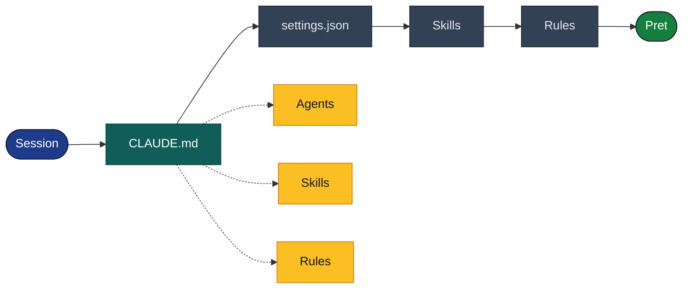
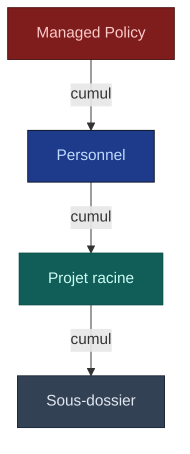

# CLAUDE.md

## TL;DR

| Aspect | Détail |
|--------|--------|
| **Quoi** | Fichier d'instructions persistantes chargé intégralement à chaque session |
| **Où** | `./CLAUDE.md` ou `./.claude/CLAUDE.md` (projet), `~/.claude/CLAUDE.md` (personnel) |
| **Rôle** | Source unique de vérité : chemins, commandes, workflow, conventions |
| **Chargement** | Intégral (pas de limite de taille), survit à `/compact` |
| **Relation** | Orchestre tout — agents, skills et rules lisent CLAUDE.md |

---

## Qu'est-ce que CLAUDE.md ?

`CLAUDE.md` est le **premier fichier que Claude charge** à chaque session. Il contient les instructions permanentes du projet : chemins, conventions, commandes disponibles et workflow. C'est la « mémoire de travail » de Claude pour votre projet.

::: warning Contexte, pas enforcement
CLAUDE.md fournit du **contexte et des instructions** que Claude suit au mieux, mais ce n'est pas un mécanisme d'enforcement. Pour bloquer des actions, utiliser les **permissions** dans [`settings.json`](/concepts/settings) (deny) ou le [**sandbox**](https://docs.anthropic.com/en/docs/claude-code/security#sandbox).
:::



| Etape | Fichier | Ce qui est charge |
|:-----:|---------|-------------------|
| 1 | **CLAUDE.md** | Chemins, commandes, workflow (integral + `@imports`) |
| 2 | **[settings.json](/concepts/settings)** | Permissions allow/deny, sandbox, hooks |
| 3 | **[Skills](/concepts/skills)** | Descriptions des skills passives + launchers |
| 4 | **[Rules](/concepts/rules)** | Contenu injecte selon les fichiers manipules (glob match) |

::: tip Qui consomme CLAUDE.md ?
Les **[agents](/concepts/agents)** lisent les chemins (`SOURCE_PROJECT`, `BACKEND_TARGET`...), les **[skills](/concepts/skills)** l'utilisent comme contexte de reference, et les **[rules](/concepts/rules)** completent avec du detail cible.
:::

---

## Comment ça marche

### Découverte et chargement

#### Emplacements

Claude découvre les fichiers CLAUDE.md par un **directory tree walk** — il parcourt l'arborescence depuis la racine du projet :

| Emplacement | Portée | Partage |
|-------------|--------|---------|
| `~/.claude/CLAUDE.md` | Personnel (tous projets) | Non |
| `./CLAUDE.md` | Projet (racine) | Oui (git) |
| `./.claude/CLAUDE.md` | Projet (alternatif) | Oui (git) |
| `./src/CLAUDE.md` | Sous-dossier | Oui (git) |
| `./src/components/CLAUDE.md` | Sous-sous-dossier | Oui (git) |

::: info Directory tree walk (top-down)
Claude parcourt l'arborescence **de la racine vers les sous-dossiers**. Les fichiers racine (`~/.claude/CLAUDE.md`, `./CLAUDE.md`) sont chargés **au démarrage de la session**. Les fichiers de sous-dossiers (`src/CLAUDE.md`) sont chargés **à la demande**, quand Claude travaille dans ce dossier.
:::

::: warning Deux fichiers racine ?
Si `./CLAUDE.md` **et** `./.claude/CLAUDE.md` existent tous les deux, `./CLAUDE.md` a priorité. Préférer un seul emplacement pour éviter toute ambiguïté.
:::

#### Priorité de chargement



::: info Cumul, pas remplacement
Tous les niveaux de CLAUDE.md sont chargés **simultanément** — ils se **cumulent**, ils ne se remplacent pas. La priorité ne s'applique qu'en cas d'**instructions contradictoires** entre niveaux : le niveau le plus haut l'emporte.
:::

| Priorité | Niveau | Emplacement | Partage |
|:--------:|--------|-------------|---------|
| MAX | **Managed Policy** | `/etc/claude-code/CLAUDE.md` | Organisation (non excluable) |
| Haute | **Personnel** | `~/.claude/CLAUDE.md` | Non (local) |
| Normale | **Projet racine** | `./CLAUDE.md` | Oui (git) |
| Contextuelle | **Sous-dossier** | `./src/CLAUDE.md` | Oui (git) |

### Contenu et organisation

#### Structure recommandée

```markdown
# Nom du Projet

## Configuration

### Chemins (PATHS)
| Alias | Chemin | Description |
|-------|--------|-------------|
| `SRC` | `./src/` | Code source |
| `TESTS` | `./tests/` | Tests |

### Commandes
- `npm test` : Lancer les tests
- `npm run lint` : Vérifier le style

## Workflow
### Skills disponibles
- `/migrate <nom>` : Migration E2E

### Ordre
1. Analyse → 2. Migration → 3. Documentation
```

#### @import : inclure des fichiers

CLAUDE.md supporte l'import de fichiers pour garder le fichier principal court :

```markdown
# Mon Projet

@import ./docs/conventions.md
@import ./docs/api-guide.md
@import .claude/project-context.md
```

| Aspect | Détail |
|--------|--------|
| **Syntaxe** | `@import <chemin-relatif>` |
| **Profondeur max** | 5 niveaux d'imports imbriqués |
| **Résolution** | Relatif au fichier contenant l'import |
| **Échec** | Fichier manquant = ignoré silencieusement (pas d'erreur) |

#### CLAUDE.md vs MEMORY.md

Claude maintient aussi un fichier de mémoire automatique :

```
~/.claude/projects/<project>/memory/MEMORY.md
```

| Aspect | CLAUDE.md | MEMORY.md |
|--------|-----------|-----------|
| **Nature** | Instructions stables, écrites par l'humain | Notes évolutives, écrites par Claude |
| **Chargement** | Intégral (pas de limite) | Tronqué après 200 lignes |
| **Survie à `/compact`** | Oui — re-lu depuis le disque | Oui — rechargé (200 premières lignes) |
| **Persistence** | Dans le repo (git) | Local (`~/.claude/projects/`) |
| **Contenu** | Chemins, commandes, workflow, conventions | Patterns découverts, corrections, décisions |
| **Modifié par** | L'utilisateur (manuellement) | Claude (automatiquement) |
| **Commande** | `/init` (génération initiale) | `/memory` (voir/éditer) |

::: info 200 lignes = MEMORY.md, pas CLAUDE.md
La limite de 200 lignes s'applique à **MEMORY.md**, pas à CLAUDE.md. MEMORY.md est écrit **automatiquement par Claude** — sans limite, il gonflerait indéfiniment. Claude compense en déplaçant les notes détaillées dans des fichiers thématiques séparés chargés à la demande. CLAUDE.md est écrit **par vous** (contenu intentionnel), donc pas de limite — mais garder < 200 lignes reste une bonne pratique pour l'adhérence.
:::

### Configuration

#### claudeMdExcludes

Pour empêcher Claude de charger des CLAUDE.md dans certains dossiers (ex. `node_modules`, `vendor`) :

```json
{
  "claudeMdExcludes": ["node_modules", "vendor", "dist", ".git"]
}
```

Configurable dans [`settings.json`](/concepts/settings) à n'importe quel scope.

#### --add-dir

Pour ajouter des répertoires hors du projet courant au scope de Claude :

```bash
claude --add-dir /path/to/other/project
```

Claude chargera aussi les CLAUDE.md trouvés dans ces répertoires supplémentaires, avec les mêmes règles de découverte.

### Comportement runtime

#### Chargement intégral

CLAUDE.md est chargé **en entier** à chaque requête, sans limite de taille. Les fichiers `@import` sont **expansés au chargement** et deviennent partie intégrante du contenu. Utiliser `/status` pour vérifier quels fichiers CLAUDE.md sont effectivement chargés dans la session courante.

::: tip Recommandation officielle
Bien qu'il n'y ait **aucune limite technique**, la doc officielle recommande de viser **< 200 lignes**. Un fichier trop long consomme du contexte à chaque requête et **réduit l'adhérence** — Claude suit moins bien les instructions noyées dans un fichier massif. Extraire le détail dans des skills ou `@import`.
:::

#### Survie à /compact

CLAUDE.md **survit à la compaction** grâce à un mécanisme de **reconstruction** (pas de préservation) :

1. La compaction est déclenchée (auto ou manuelle via `/compact`)
2. Le hook `PreCompact` se déclenche (si configuré)
3. Le contexte conversation est compressé : anciens outputs supprimés, messages résumés
4. **CLAUDE.md est re-lu depuis le disque** et ré-injecté frais dans le nouveau contexte
5. Les fichiers `@import` sont également re-expansés

| Élément | Pendant la compaction |
|---------|----------------------|
| **CLAUDE.md** | Re-lu depuis le disque, ré-injecté à 100% |
| **Conversation** | Résumée (anciens outputs supprimés, messages clés gardés) |
| **MEMORY.md** | Rechargé (200 premières lignes) |
| **Skills / Rules** | Descriptions disponibles, inchangées |
| **Serveurs MCP** | Connexions maintenues |

::: warning Si une instruction disparaît après /compact...
C'est qu'elle était dans la **conversation**, pas dans CLAUDE.md. Mettre les instructions persistantes dans CLAUDE.md, pas dans le chat.
:::

#### Initialisation avec /init

La commande `/init` génère un CLAUDE.md initial pour votre projet :

```bash
# Dans Claude Code
/init
```

Claude analyse le projet (structure, stack, commandes) et génère un CLAUDE.md adapté. Utile pour démarrer rapidement sur un nouveau projet.

---

## Guide pratique : concevoir son CLAUDE.md

### Matrice d'usage : quoi mettre où ?

| Information | Où la mettre | Pourquoi |
|-------------|-------------|----------|
| Chemins du projet | **CLAUDE.md** | Source unique de vérité |
| Commandes disponibles | **CLAUDE.md** | Vue d'ensemble du workflow |
| Stack technique (1 ligne) | **CLAUDE.md** | Contexte global |
| Conventions détaillées | **[Skill passive](/concepts/skills)** | Trop long pour CLAUDE.md |
| Rappel contextuel court | **[Rule](/concepts/rules)** | Injecté selon les fichiers |
| Préférences personnelles | **~/.claude/CLAUDE.md** | Pas dans le repo |
| Notes de session | **MEMORY.md** | Évolue automatiquement |
| Sécurité (deny/allow) | **[settings.json](/concepts/settings)** | Enforcement réel (pas juste contexte) |

### Warnings

#### ⚠️ `WARN-001` : Fichier trop long / monolithique

Un CLAUDE.md de 200+ lignes noie les informations essentielles et réduit l'adhérence de Claude.

::: danger Problème
```markdown
## Architecture (100 lignes)
## Patterns (100 lignes)
## DTOs (100 lignes)
```
Tout dans un seul fichier — impossible à scanner, Claude ne distingue plus l'essentiel.
:::

::: info Solution
```markdown
## Stack
Symfony 7.4, PostgreSQL, Docker

## Conventions
Voir skill `symfony/api-conventions` pour le détail.

## Architecture
@import ./docs/architecture.md
```
Garder CLAUDE.md **court et factuel** (< 200 lignes). Déléguer le détail aux skills, rules ou `@import`.
:::

---

#### ⚠️ `WARN-002` : Chemins hardcodés dans les agents

Si un dossier est renommé, il faut modifier chaque agent un par un.

::: danger Problème
```markdown
Lire les fichiers dans ./php-classified-ads-legacy/
```
Chemin en dur dans l'agent — fragile et source de bugs silencieux.
:::

::: info Solution
```markdown
Lire SOURCE_PROJECT (défini dans CLAUDE.md)
```
L'agent lit le chemin depuis CLAUDE.md. Si le dossier est renommé, **un seul endroit à modifier**.
:::

---

#### ⚠️ `WARN-003` : Conventions dupliquées

Les mêmes conventions écrites à deux endroits divergent inévitablement.

::: danger Problème
```markdown
## Conventions
- PSR-12 strict
- camelCase méthodes
```
Dupliqué dans CLAUDE.md **et** dans la skill — lequel fait foi ?
:::

::: info Solution
```markdown
## Conventions
Voir skill `symfony/api-conventions`.
```
Une seule source de vérité. CLAUDE.md **pointe** vers la skill, sans dupliquer.
:::

---

#### ⚠️ `WARN-004` : Instructions temporaires

CLAUDE.md est chargé à **chaque session**. Les tâches en cours n'ont pas leur place ici.

::: danger Problème
```markdown
## TODO
- Finir la migration Search_Engine
- Corriger le bug #42
```
Ces notes polluent le fichier permanent et deviennent obsolètes.
:::

::: info Solution
Utiliser **MEMORY.md** (`/memory`) pour les notes de session et les tâches en cours. CLAUDE.md reste réservé aux instructions **permanentes**.
:::

---

#### ⚠️ `WARN-005` : Confondre CLAUDE.md et permissions

CLAUDE.md est du **contexte**, pas un mécanisme de blocage.

::: danger Problème
```markdown
## Règles
Ne JAMAIS modifier les fichiers dans php-legacy/
```
Claude fera de son mieux, mais rien ne l'empêche **techniquement** de modifier ces fichiers.
:::

::: info Solution
Utiliser `deny` dans **[settings.json](/concepts/settings)** pour un blocage réel :
```json
{ "deny": ["Edit(php-legacy/**)", "Write(php-legacy/**)"] }
```
CLAUDE.md fournit le **pourquoi**, settings.json applique le **blocage**.
:::

---

## Contrôle avancé

### Hook InstructionsLoaded

Le [hook](/concepts/hooks) `InstructionsLoaded` se déclenche après le chargement de CLAUDE.md et toutes les instructions :

```json
{
  "hooks": {
    "InstructionsLoaded": [{
      "type": "command",
      "command": "echo 'Instructions chargees pour le projet'"
    }]
  }
}
```

Utile pour du logging, des validations custom, ou l'injection dynamique de contexte.

### Enterprise : managed CLAUDE.md

Les organisations peuvent forcer des instructions via managed settings. Ces instructions ont **priorité maximale** et ne peuvent pas être surchargées par les fichiers projet ou utilisateur.

| OS | Chemin |
|----|--------|
| macOS | `/Library/Application Support/ClaudeCode/CLAUDE.md` |
| Linux | `/etc/claude-code/CLAUDE.md` |
| Windows | `C:\Program Files\ClaudeCode\CLAUDE.md` |

::: warning Non excluable
Les instructions managed ne peuvent **pas** être ignorées via `claudeMdExcludes`. C'est voulu pour garantir les standards de l'organisation.
:::

### Troubleshooting

| Problème | Diagnostic | Solution |
|----------|-----------|----------|
| Instructions ignorées | `/status` → vérifier le chargement | Vérifier l'emplacement du fichier |
| CLAUDE.md sous-dossier pas chargé | Le fichier est dans un dossier exclu | Vérifier `claudeMdExcludes` |
| @import ne fonctionne pas | Chemin relatif incorrect | Vérifier le chemin depuis le fichier parent |
| Instructions perdues après /compact | Ne devrait pas arriver | CLAUDE.md survit à /compact — vérifier que ce n'est pas du contexte conversation |
| MEMORY.md tronqué | Normal au-delà de 200 lignes | Garder MEMORY.md concis, archiver les anciennes notes |

---

## Exemples concrets

### Exemple 1 : Projet de modernisation

```markdown
# Projet de Modernisation Legacy

## Configuration du Projet

> **SOURCE UNIQUE DE VERITE** : Tous les subagents et skills
> DOIVENT lire leurs chemins depuis cette section.

### Chemins (PATHS)

| Alias | Chemin | Description |
|-------|--------|-------------|
| `SOURCE_PROJECT` | `./php-legacy` | Legacy (LECTURE SEULE) |
| `BACKEND_TARGET` | `./api-rest-symfony-target/` | Backend cible |
| `FRONTEND_TARGET` | `./app-react-target/` | Frontend cible |
| `OPENAPI_SPEC` | `./api-rest-symfony-target/docs/openapi.yaml` | Spec OpenAPI |
| `FEATURE_SPECS_DIR` | `./output/features/` | Specifications |
| `REPORTS_DIR` | `./output/reports/` | Rapports conformite |

### Commandes
- `/dev/commit` : Conventional Commits
- `/dev/php-test` : Tests backend
- `/modernization/migrate-feature <nom>` : Migration E2E

### Workflow
1. `/modernization/analyze-legacy`
2. `/modernization/migrate-feature <nom>` (par feature)
3. `/modernization/generate-docs`
```

### Exemple 2 : Projet avec @import

```markdown
# API Platform

## Stack
Node.js 22, TypeScript, PostgreSQL, Docker

## Chemins
| Alias | Chemin | Description |
|-------|--------|-------------|
| `SRC` | `./src/` | Code source |
| `TESTS` | `./tests/` | Tests |

## Conventions
@import ./docs/coding-standards.md
@import ./docs/api-design.md

## Commandes
- `npm test` : Tests
- `npm run build` : Build
```

### Exemple 3 : CLAUDE.md personnel

`~/.claude/CLAUDE.md` :

```markdown
# Preferences personnelles

## Langue
Toujours repondre en francais.

## Workflow
- Toujours utiliser les Conventional Commits
- Preferer les commits atomiques
- Ne jamais push sans confirmation

## Style
- Code concis, pas de commentaires evidents
- Noms de variables explicites
```

---

## Checklist de lancement

### Contenu

- [ ] Chemins centralisés dans une table unique
- [ ] Note "SOURCE UNIQUE DE VERITE" visible
- [ ] Commandes et skills documentés
- [ ] Stack technique en 1 ligne

### Organisation

- [ ] CLAUDE.md court — détail dans skills ou `@import`
- [ ] Pas de conventions détaillées (dans les skills)
- [ ] Pas d'instructions temporaires (dans MEMORY.md)
- [ ] Pas de règles de sécurité (dans settings.json deny)

### Découverte

- [ ] CLAUDE.md à la racine (`./` ou `./.claude/`)
- [ ] `claudeMdExcludes` pour les dossiers à ignorer (`node_modules`, `vendor`)
- [ ] Sous-dossiers CLAUDE.md si nécessaire (contextuel)
- [ ] `@import` avec profondeur max 5

### Vérification

- [ ] `/init` pour générer un CLAUDE.md initial
- [ ] `/status` pour vérifier le chargement
- [ ] `/memory` pour vérifier la mémoire auto
- [ ] CLAUDE.md survit à `/compact` — tester

---

## Ressources

- [Documentation officielle — Memory](https://code.claude.com/docs/en/memory)
