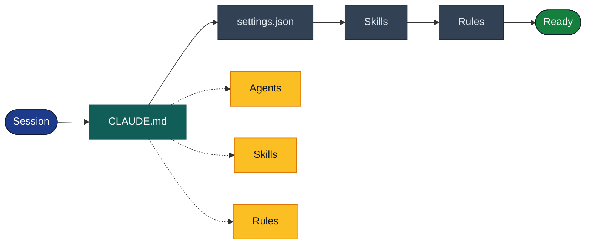
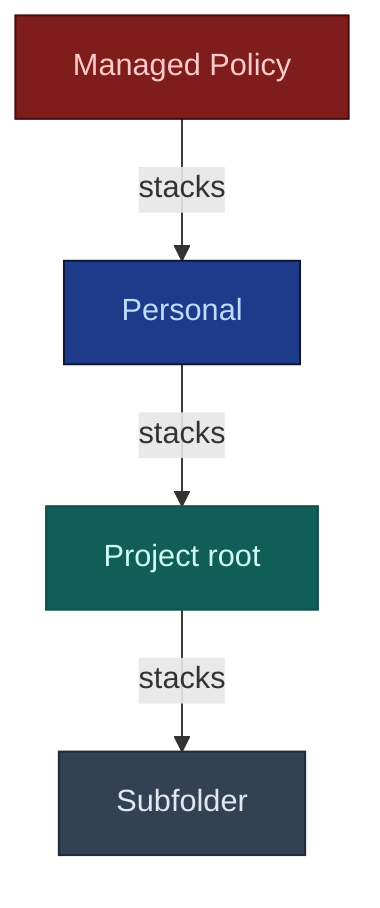

# CLAUDE.md

## TL;DR

| Aspect | Detail |
|--------|--------|
| **What** | Persistent instructions file loaded in full at every session |
| **Where** | `./CLAUDE.md` or `./.claude/CLAUDE.md` (project), `~/.claude/CLAUDE.md` (personal) |
| **Role** | Single source of truth: paths, commands, workflow, conventions |
| **Loading** | Full (no size limit), survives `/compact` |
| **Relationship** | Orchestrates everything — agents, skills and rules read CLAUDE.md |

---

## What is CLAUDE.md?

`CLAUDE.md` is the **first file Claude loads** at every session. It contains the project's permanent instructions: paths, conventions, available commands and workflow. It is Claude's "working memory" for your project.

::: warning Context, not enforcement
CLAUDE.md provides **context and instructions** that Claude follows to the best of its ability, but it is not an enforcement mechanism. To block actions, use **permissions** in [`settings.json`](/en/concepts/settings) (deny) or the [**sandbox**](https://docs.anthropic.com/en/docs/claude-code/security#sandbox).
:::



| Step | File | What is loaded |
|:----:|------|----------------|
| 1 | **CLAUDE.md** | Paths, commands, workflow (full + `@imports`) |
| 2 | **[settings.json](/en/concepts/settings)** | Permissions allow/deny, sandbox, hooks |
| 3 | **[Skills](/en/concepts/skills)** | Passive + launcher skill descriptions |
| 4 | **[Rules](/en/concepts/rules)** | Content injected based on manipulated files (glob match) |

::: tip Who consumes CLAUDE.md?
**[Agents](/en/concepts/agents)** read paths (`SOURCE_PROJECT`, `BACKEND_TARGET`...), **[skills](/en/concepts/skills)** use it as reference context, and **[rules](/en/concepts/rules)** complement with targeted detail.
:::

---

## How It Works

### Discovery and Loading

#### Locations

Claude discovers CLAUDE.md files through a **directory tree walk** — it traverses the tree from the project root:

| Location | Scope | Shared |
|----------|-------|--------|
| `~/.claude/CLAUDE.md` | Personal (all projects) | No |
| `./CLAUDE.md` | Project (root) | Yes (git) |
| `./.claude/CLAUDE.md` | Project (alternate) | Yes (git) |
| `./src/CLAUDE.md` | Subfolder | Yes (git) |
| `./src/components/CLAUDE.md` | Sub-subfolder | Yes (git) |

::: info Directory tree walk (top-down)
Claude traverses the tree **from root to subfolders**. Root files (`~/.claude/CLAUDE.md`, `./CLAUDE.md`) are loaded **at session start**. Subfolder files (`src/CLAUDE.md`) are loaded **on demand**, when Claude works in that directory.
:::

::: warning Two root files?
If both `./CLAUDE.md` **and** `./.claude/CLAUDE.md` exist, `./CLAUDE.md` takes precedence. Prefer a single location to avoid ambiguity.
:::

#### Loading Priority



| Priority | Level | Location | Shared |
|:--------:|-------|----------|--------|
| Highest | **Managed Policy** | `/etc/claude-code/CLAUDE.md` | Organization (not excludable) |
| High | **Personal** | `~/.claude/CLAUDE.md` | No (local) |
| Normal | **Project root** | `./CLAUDE.md` | Yes (git) |
| Contextual | **Subfolder** | `./src/CLAUDE.md` | Yes (git) |

::: info Stacking, not replacing
All CLAUDE.md levels are loaded **simultaneously** — they **stack**, they don't replace each other. Priority only applies when **conflicting instructions** exist between levels: the higher level wins.
:::

### Content and Organization

#### Recommended Structure

```markdown
# Project Name

## Configuration

### Paths (PATHS)
| Alias | Path | Description |
|-------|------|-------------|
| `SRC` | `./src/` | Source code |
| `TESTS` | `./tests/` | Tests |

### Commands
- `npm test` : Run tests
- `npm run lint` : Check style

## Workflow
### Available Skills
- `/migrate <name>` : E2E Migration

### Order
1. Analysis → 2. Migration → 3. Documentation
```

#### @import: Including Files

CLAUDE.md supports importing files to keep the main file short:

```markdown
# My Project

@import ./docs/conventions.md
@import ./docs/api-guide.md
@import .claude/project-context.md
```

| Aspect | Detail |
|--------|--------|
| **Syntax** | `@import <relative-path>` |
| **Max depth** | 5 levels of nested imports |
| **Resolution** | Relative to the file containing the import |
| **Failure** | Missing file = silently ignored (no error) |

#### CLAUDE.md vs MEMORY.md

Claude also maintains an automatic memory file:

```
~/.claude/projects/<project>/memory/MEMORY.md
```

| Aspect | CLAUDE.md | MEMORY.md |
|--------|-----------|-----------|
| **Nature** | Stable instructions, written by human | Evolving notes, written by Claude |
| **Loading** | Full (no limit) | Truncated after 200 lines |
| **Survives `/compact`** | Yes — re-read from disk | Yes — reloaded (first 200 lines) |
| **Persistence** | In the repo (git) | Local (`~/.claude/projects/`) |
| **Content** | Paths, commands, workflow, conventions | Discovered patterns, corrections, decisions |
| **Modified by** | The user (manually) | Claude (automatically) |
| **Command** | `/init` (initial generation) | `/memory` (view/edit) |

::: info 200 lines = MEMORY.md, not CLAUDE.md
The 200-line limit applies to **MEMORY.md**, not CLAUDE.md. MEMORY.md is written **automatically by Claude** — without a limit, it would grow indefinitely. Claude compensates by moving detailed notes into separate topic files loaded on demand. CLAUDE.md is written **by you** (intentional content), so no limit — but keeping < 200 lines remains a best practice for adherence.
:::

### Configuration

#### claudeMdExcludes

To prevent Claude from loading CLAUDE.md files in certain folders (e.g. `node_modules`, `vendor`):

```json
{
  "claudeMdExcludes": ["node_modules", "vendor", "dist", ".git"]
}
```

Configurable in [`settings.json`](/en/concepts/settings) at any scope.

#### --add-dir

To add directories outside the current project to Claude's scope:

```bash
claude --add-dir /path/to/other/project
```

Claude will also load CLAUDE.md files found in these additional directories, with the same discovery rules.

### Runtime Behavior

#### Full loading

CLAUDE.md is loaded **in full** on every request, with no size limit. `@import` files are **expanded at load time** and become part of the content. Use `/status` to verify which CLAUDE.md files are currently loaded in your session.

::: tip Official recommendation
While there is **no technical limit**, the official docs recommend targeting **< 200 lines**. A file that's too long consumes context on every request and **reduces adherence** — Claude follows instructions less well when they're buried in a massive file. Extract detail into skills or `@import`.
:::

#### Surviving /compact

CLAUDE.md **survives compaction** through a **reconstruction** mechanism (not preservation):

1. Compaction is triggered (auto or manual via `/compact`)
2. The `PreCompact` hook fires (if configured)
3. Conversation context is compressed: old outputs removed, messages summarized
4. **CLAUDE.md is re-read from disk** and re-injected fresh into the new context
5. `@import` files are also re-expanded

| Element | During compaction |
|---------|-------------------|
| **CLAUDE.md** | Re-read from disk, re-injected at 100% |
| **Conversation** | Summarized (old outputs removed, key messages kept) |
| **MEMORY.md** | Reloaded (first 200 lines) |
| **Skills / Rules** | Descriptions available, unchanged |
| **MCP Servers** | Connections maintained |

::: warning If an instruction disappears after /compact...
It was in the **conversation**, not in CLAUDE.md. Put persistent instructions in CLAUDE.md, not in chat.
:::

#### Initialization with /init

The `/init` command generates an initial CLAUDE.md for your project:

```bash
# In Claude Code
/init
```

Claude analyzes the project (structure, stack, commands) and generates an appropriate CLAUDE.md. Useful for quickly getting started on a new project.

---

## Practical Guide: Designing Your CLAUDE.md

### Usage Matrix: What Goes Where?

| Information | Where to Put It | Why |
|-------------|----------------|-----|
| Project paths | **CLAUDE.md** | Single source of truth |
| Available commands | **CLAUDE.md** | Workflow overview |
| Tech stack (1 line) | **CLAUDE.md** | Global context |
| Detailed conventions | **Passive skill** | Too long for CLAUDE.md |
| Short contextual reminder | **Rule** | Injected based on files |
| Personal preferences | **~/.claude/CLAUDE.md** | Not in the repo |
| Session notes | **MEMORY.md** | Evolves automatically |
| Security (deny/allow) | **[settings.json](/en/concepts/settings)** | Real enforcement (not just context) |

### Warnings

#### ⚠️ `WARN-001`: File too long / monolithic

A 200+ line CLAUDE.md drowns essential information and reduces Claude's adherence.

::: danger Problem
```markdown
## Architecture (100 lines)
## Patterns (100 lines)
## DTOs (100 lines)
```
Everything in a single file — impossible to scan, Claude can no longer distinguish what's essential.
:::

::: info Solution
```markdown
## Stack
Symfony 7.4, PostgreSQL, Docker

## Conventions
See skill `symfony/api-conventions` for details.

## Architecture
@import ./docs/architecture.md
```
Keep CLAUDE.md **short and factual** (< 200 lines). Delegate details to skills, rules or `@import`.
:::

---

#### ⚠️ `WARN-002`: Hardcoded paths in agents

If a folder is renamed, you have to update every agent one by one.

::: danger Problem
```markdown
Read files in ./php-classified-ads-legacy/
```
Hardcoded path in the agent — fragile and a source of silent bugs.
:::

::: info Solution
```markdown
Read SOURCE_PROJECT (defined in CLAUDE.md)
```
The agent reads the path from CLAUDE.md. If the folder is renamed, **only one place to update**.
:::

---

#### ⚠️ `WARN-003`: Duplicated conventions

The same conventions written in two places will inevitably diverge.

::: danger Problem
```markdown
## Conventions
- PSR-12 strict
- camelCase methods
```
Duplicated in CLAUDE.md **and** in the skill — which one is authoritative?
:::

::: info Solution
```markdown
## Conventions
See skill `symfony/api-conventions`.
```
A single source of truth. CLAUDE.md **points** to the skill, without duplicating.
:::

---

#### ⚠️ `WARN-004`: Temporary instructions

CLAUDE.md is loaded at **every session**. In-progress tasks don't belong here.

::: danger Problem
```markdown
## TODO
- Finish the Search_Engine migration
- Fix bug #42
```
These notes pollute the permanent file and become stale.
:::

::: info Solution
Use **MEMORY.md** (`/memory`) for session notes and in-progress tasks. CLAUDE.md is reserved for **permanent** instructions only.
:::

---

#### ⚠️ `WARN-005`: Confusing CLAUDE.md with permissions

CLAUDE.md is **context**, not a blocking mechanism.

::: danger Problem
```markdown
## Rules
NEVER modify files in php-legacy/
```
Claude will try its best, but nothing **technically** prevents it from modifying those files.
:::

::: info Solution
Use `deny` in **[settings.json](/en/concepts/settings)** for actual blocking:
```json
{ "deny": ["Edit(php-legacy/**)", "Write(php-legacy/**)"] }
```
CLAUDE.md provides the **why**, settings.json enforces the **block**.
:::

---

## Advanced Control

### InstructionsLoaded Hook

The `InstructionsLoaded` [hook](/en/concepts/hooks) fires after CLAUDE.md and all instructions are loaded:

```json
{
  "hooks": {
    "InstructionsLoaded": [{
      "type": "command",
      "command": "echo 'Instructions loaded for the project'"
    }]
  }
}
```

Useful for logging, custom validations, or dynamic context injection.

### Enterprise: Managed CLAUDE.md

Organizations can enforce instructions via managed settings. These instructions have **highest priority** and cannot be overridden by project or user files.

| OS | Path |
|----|------|
| macOS | `/Library/Application Support/ClaudeCode/CLAUDE.md` |
| Linux | `/etc/claude-code/CLAUDE.md` |
| Windows | `C:\Program Files\ClaudeCode\CLAUDE.md` |

::: warning Not excludable
Managed instructions **cannot** be ignored via `claudeMdExcludes`. This is by design to ensure organization standards.
:::

### Troubleshooting

| Problem | Diagnosis | Solution |
|---------|----------|----------|
| Instructions ignored | `/status` → check loading | Verify file location |
| Subfolder CLAUDE.md not loaded | File is in an excluded folder | Check `claudeMdExcludes` |
| @import not working | Incorrect relative path | Verify path from parent file |
| Instructions lost after /compact | Should not happen | CLAUDE.md survives /compact — check that it's not conversation context |
| MEMORY.md truncated | Normal beyond 200 lines | Keep MEMORY.md concise, archive old notes |

---

## Concrete Examples

### Example 1: Modernization project

```markdown
# Legacy Modernization Project

## Project Configuration

> **SINGLE SOURCE OF TRUTH**: All subagents and skills
> MUST read their paths from this section.

### Paths (PATHS)

| Alias | Path | Description |
|-------|------|-------------|
| `SOURCE_PROJECT` | `./php-legacy` | Legacy (READ-ONLY) |
| `BACKEND_TARGET` | `./api-rest-symfony-target/` | Target backend |
| `FRONTEND_TARGET` | `./app-react-target/` | Target frontend |
| `OPENAPI_SPEC` | `./api-rest-symfony-target/docs/openapi.yaml` | OpenAPI spec |
| `FEATURE_SPECS_DIR` | `./output/features/` | Specifications |
| `REPORTS_DIR` | `./output/reports/` | Conformity reports |

### Commands
- `/dev/commit` : Conventional Commits
- `/dev/php-test` : Backend tests
- `/modernization/migrate-feature <name>` : E2E migration

### Workflow
1. `/modernization/analyze-legacy`
2. `/modernization/migrate-feature <name>` (per feature)
3. `/modernization/generate-docs`
```

### Example 2: Project with @import

```markdown
# API Platform

## Stack
Node.js 22, TypeScript, PostgreSQL, Docker

## Paths
| Alias | Path | Description |
|-------|------|-------------|
| `SRC` | `./src/` | Source code |
| `TESTS` | `./tests/` | Tests |

## Conventions
@import ./docs/coding-standards.md
@import ./docs/api-design.md

## Commands
- `npm test` : Tests
- `npm run build` : Build
```

### Example 3: Personal CLAUDE.md

`~/.claude/CLAUDE.md`:

```markdown
# Personal Preferences

## Language
Always respond in French.

## Workflow
- Always use Conventional Commits
- Prefer atomic commits
- Never push without confirmation

## Style
- Concise code, no obvious comments
- Explicit variable names
```

---

## Launch Checklist

### Content

- [ ] Paths centralized in a single table
- [ ] "SINGLE SOURCE OF TRUTH" note visible
- [ ] Commands and skills documented
- [ ] Tech stack in 1 line

### Organization

- [ ] CLAUDE.md short — details in skills or `@import`
- [ ] No detailed conventions (those go in skills)
- [ ] No temporary instructions (those go in MEMORY.md)
- [ ] No security rules (those go in settings.json deny)

### Discovery

- [ ] CLAUDE.md at root (`./` or `./.claude/`)
- [ ] `claudeMdExcludes` for folders to ignore (`node_modules`, `vendor`)
- [ ] Subfolder CLAUDE.md files if needed (contextual)
- [ ] `@import` with max depth of 5

### Verification

- [ ] `/init` to generate an initial CLAUDE.md
- [ ] `/status` to verify loading
- [ ] `/memory` to check auto-memory
- [ ] CLAUDE.md survives `/compact` — test it

---

## Resources

- [Official Documentation — Memory](https://code.claude.com/docs/en/memory)
