# AI-Driven Modernisation: Legacy Transmutation

> Transmute any legacy project into modern architecture — AI-powered, **architect/senior supervised** at every phase, driven by the Claude Code ecosystem.

## Target Technologies

This methodology is **source-technology agnostic**. It applies to any legacy migration, regardless of the original stack.

| Target | Typical stack |
|--------|-------------|
| **React** | Web SPA with TypeScript, Vite, Tailwind |
| **React Native** | Cross-platform mobile application |
| **Symfony** | PHP REST API backend, PostgreSQL, JWT |
| **NestJS / Node.js** | TypeScript REST API backend, microservices |

:::info Illustrated example
In this page, the concrete example is a **procedural PHP → Symfony 7.4 + React 19** migration. The principles and pipeline apply identically to other targets.
:::

---

## 3 Founding Principles

| Principle | In practice |
|-----------|-----------|
| **Understand before acting** | Never modify code without analyzing it in depth. Analysis produces written artifacts, not verbal summaries. |
| **The plan is a file** | Each step produces a Markdown file that serves as a relay to the next step. No shared context between agents. |
| **Implementation is mechanical** | All thinking happens in analysis and planning phases. Code follows specs and conventions. |

---

## Guardrails: ensuring functional conformity

> **Promise**: the modernized system does **exactly** what the legacy did.
> Six guardrails form a traceability chain from legacy code to modern code.

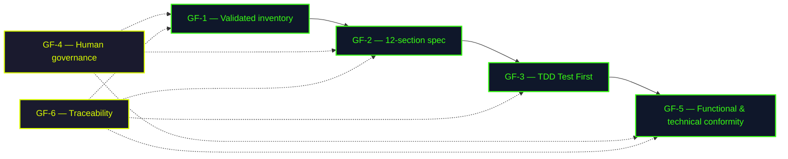

| # | Guardrail | Phase | What it guarantees |
|---|-----------|-------|--------------------|
| **GF-1** | **Human validation of the inventory: we implement what we validate** | Phase 1 | The client/PO confirms that 100% of features, roles and business flows are captured. Nothing is implemented without being validated. |
| **GF-2** | **12-section spec from legacy** | Phase 3 | Each feature is specified from legacy code. User scenarios and acceptance criteria reflect existing behavior. |
| **GF-3** | **TDD — Test First** | Phase 3 | Each spec scenario becomes a test **before** code. The test fails first (red), then code makes it pass (green). No legacy behavior is forgotten — if it's in the spec, it has a test. |
| **GF-4** | **Human governance** | All | Architect required at every phase. Client/PO validates functional aspects. Automatic STOP if score < 80 after 2 iterations — human takes over. |
| **GF-5** | **Functional and technical conformity** | Phase 3 | The conformity-reporter compares produced code against the spec (derived from legacy). Score < 80 = mandatory corrections. Versioned reports (V1, V2, V3). |
| **GF-6** | **Complete traceability** | All | Every artifact is a versioned file. You can trace any piece of code back to the legacy business rule that motivated it. |

---

## Human Oversight

Claude agents automate execution, but **structural decisions remain human**. Two complementary roles are involved throughout the process:

<div class="role-cards">
  <div class="role-card architect">
    <h4>Architect / Senior</h4>
    <ul>
      <li>Drives technical aspects and <strong>validates each phase</strong></li>
      <li>Defines conventions and target structure</li>
      <li>Decides migration order</li>
      <li>Supervises the quality loop</li>
      <li>Presence is <strong>mandatory</strong> throughout the process</li>
    </ul>
  </div>
  <div class="role-card client">
    <h4>Client / PO / Business</h4>
    <ul>
      <li>Guarantees <strong>functional fidelity</strong></li>
      <li>Validates inventory (features, roles, flows)</li>
      <li>Prioritizes features by business value</li>
      <li>Validates specs before implementation</li>
      <li>Presence <strong>strongly recommended</strong> (phases 1, 2, 3)</li>
    </ul>
  </div>
</div>

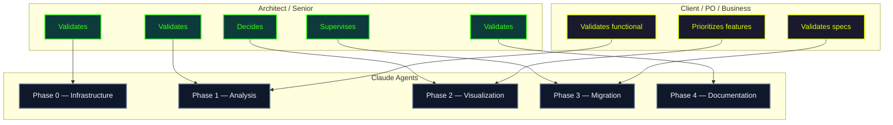

| Phase | Architect / Senior | Client / PO / Business |
|-------|-------------------|----------------------|
| **Phase 0 — Infrastructure** | Defines target conventions, validates `.claude/` structure, chooses target technologies | — |
| **Phase 1 — Analysis** | Reviews the technical report, corrects interpretation errors | **Validates the functional inventory**: verifies that all features, roles and business flows are present. Flags omissions or implicit rules the AI cannot deduce from code |
| **Phase 2 — Visualization** | Decides the **migration order** based on technical dependencies | **Prioritizes features** by business value. Arbitrates with the architect on the final order |
| **Phase 3 — Migration** | Approves the task plan, supervises the quality loop, intervenes if score < 80 after 2 iterations | **Validates specs** (12 sections): verifies business rules, user scenarios and acceptance criteria before implementation |
| **Phase 4 — Documentation** | Reviews and validates technical documentation | Validates functional documentation |

:::warning Mandatory presence
An architect or senior's presence is **mandatory** throughout the entire process. Client / PO participation is **strongly recommended** in phases 1, 2 and 3 — this is the time to catch omissions and adjust before code is written. Agents are execution tools, not decision-makers. The human retains control over:
- Architecture choices and migration priorities
- Functional validation (feature completeness, business rules)
- Quality/deadline/scope trade-offs
:::

---

## Overview: 5 Phases

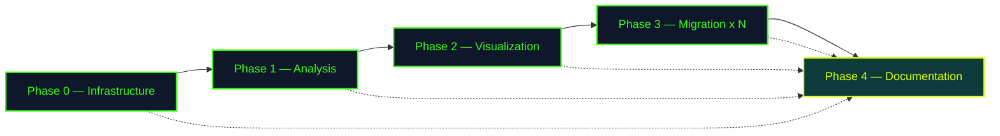

---

## Phase 0: Build the Infrastructure

Before touching any code, we build the **declarative ecosystem** that will drive all agents.

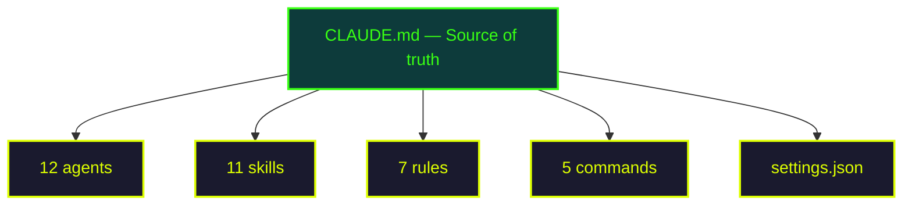

:::info Foundations we lay down
- **CLAUDE.md** centralizes all paths — one place to change
- **Rules** protect the legacy as read-only (double layer: rule + deny)
- **Skills** carry conventions — agents inherit them automatically
- **Settings** authorize Docker and git without confirmation
:::

<div class="validation-checkpoint">
<strong>Architect validation</strong> — the architect defines target conventions, validates the <code>.claude/</code> structure and permissions before launching the next phase.
</div>

---

## Phase 1: Understand the Legacy

One command triggers three agents in sequence:

```mermaid
graph LR
    CMD["/analyze-legacy"]
    T["Technical Analysis — Opus"]
    F["Functional Inventory — Sonnet"]
    A["Audit — Haiku"]
    OUT["Legacy understood"]

    CMD --> T
    T -->|rapport_technique.md| F
    F -->|inventaire.md| A
    A -->|enriched inventory| OUT

    classDef cmd fill:#0d3b3b,stroke:#39ff14,stroke-width:2px,color:#39ff14
    classDef opus fill:#1a1a2e,stroke:#ddff00,stroke-width:2px,color:#ddff00
    classDef sonnet fill:#1e3a8a,stroke:#60a5fa,stroke-width:2px,color:#93c5fd
    classDef haiku fill:#0f172a,stroke:#64748b,stroke-width:2px,color:#94a3b8
    classDef done fill:#0d3b3b,stroke:#39ff14,stroke-width:3px,color:#39ff14

    class CMD cmd
    class T opus
    class F sonnet
    class A haiku
    class OUT done
```

| Agent | Model | Role | Why this model |
|-------|-------|------|----------------|
| technical-analyzer | **Opus** | Reverse engineering raw code | Undocumented code, implicit architecture |
| functional-analyzer | **Sonnet** | Inventory of features/roles/flows | Reads the technical report, not raw code |
| functional-auditor | **Haiku** | Completeness check | Simple comparison, no reasoning needed |

**Produced artifacts:**

```
output/technique/
├── rapport_technique.md      → Architecture, DB, dependencies
├── inventaire_fonctionnel.md → Features, roles, business flows
└── arbre_fonctionnel.md      → Parent-child hierarchy
```

<div class="validation-checkpoint with-client">
<strong>Architect + client validation</strong> — the architect reviews the technical report and corrects interpretation errors. The client / PO validates the functional inventory — this is the key moment to catch missing features, forgotten roles, or implicit business rules the AI couldn't deduce from code. These adjustments are <strong>far less costly here</strong> than after implementation.
</div>

---

## Phase 2: Visualize to Decide

The inventory is transformed into **interactive visualizations** (standalone HTML with ECharts):

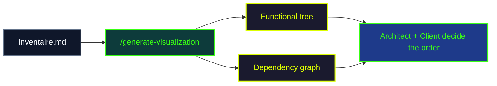

<div class="validation-checkpoint with-client">
<strong>Architect + client decision</strong> — the architect identifies <strong>independent features</strong> (no technical dependencies) to migrate first. The client prioritizes by <strong>business value</strong>. Together, they define the migration roadmap — ensuring the most business-critical features are delivered first.
</div>

---

## Phase 3: Migrate Each Feature

This is the pipeline's core. For each feature:

```bash
/modernization/migrate-feature Search_Engine
```

### The 5 Steps at a Glance

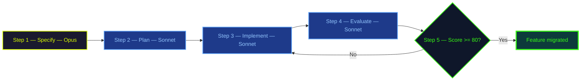

---

### Step 1 — Specify (Opus)

The Opus agent produces a **12-section spec** from legacy code and the functional inventory.

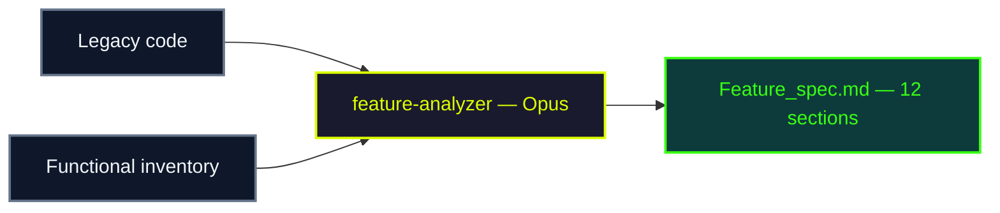

The 12 sections cover **every angle** of a feature:

```
┌─────────────────────────┬─────────────────────────┐
│ 1. Functional overview  │  7. Error handling      │
│ 2. Legacy reference     │  8. Security            │
│ 3. User scenarios       │  9. Dependencies        │
│ 4. Interface (UI)       │ 10. Data & persistence  │
│ 5. Business rules       │ 11. Performance         │
│ 6. Validation           │ 12. Acceptance criteria │
└─────────────────────────┴─────────────────────────┘
```

<div class="validation-checkpoint with-client">
<strong>Architect + client validation</strong> — the architect verifies technical coherence (dependencies, data, performance). The client validates <strong>business rules, user scenarios and acceptance criteria</strong> — last opportunity to correct before planning begins. If needed, the <code>refiner</code> agent (Sonnet) refines the spec — the corrected file is suffixed <code>-corrected</code>.
</div>

---

### Step 2 — Plan (Sonnet)

Two planners decompose the spec into **numbered tasks with dependencies**:

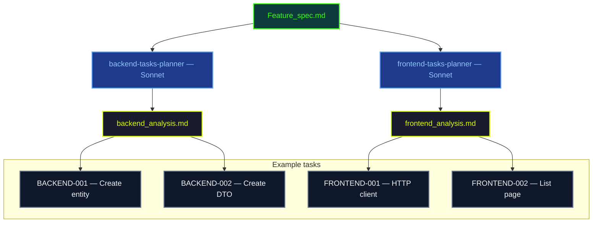

Each task contains:
- A **unique ID** (BACKEND-001, FRONTEND-002...)
- Its **dependencies** (which tasks must complete first)
- A **skill reference** (e.g. `create-entity.md`) for conventions
- Precise **acceptance criteria**

<div class="validation-checkpoint">
<strong>Architect validation</strong> — the architect approves the task breakdown, verifies dependencies and execution order.
</div>

---

### Step 3 — Implement with TDD (Sonnet)

Executors implement each task **Test First**:


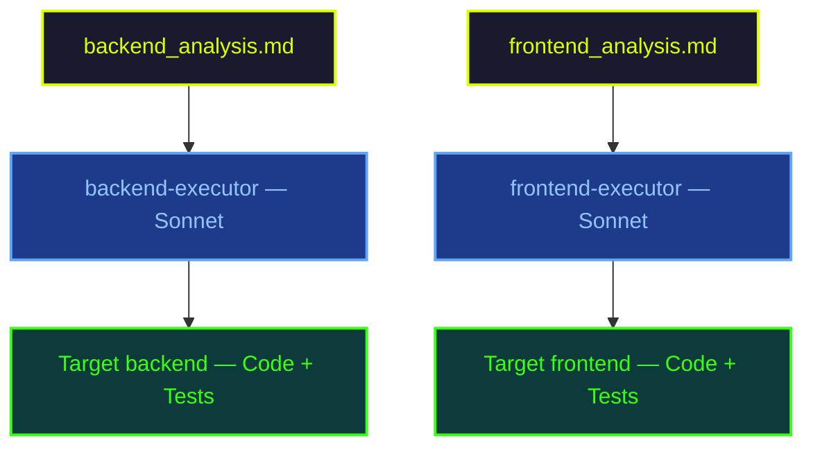

**The secret: skills as guardrails.** Executors don't guess conventions — they read `create-entity.md`, `create-dto.md`, `create-controller.md`. This guarantees consistency across features.

---

### Step 4 — Evaluate Conformity (Sonnet)

The agent **objectively scores** code against the spec:

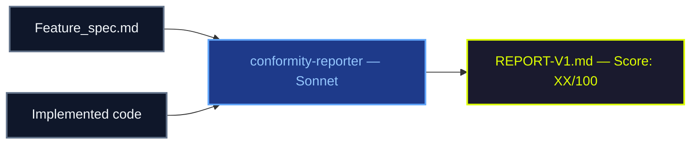

Deduction system from an initial score of 100:

| Severity | Deduction | Concrete example |
|----------|-----------|-----------------|
| Critical | **-15 pts** | Missing API endpoint |
| High | **-10 pts** | Pagination not implemented |
| Medium | **-5 pts** | Relevance sorting absent |
| Low | **-2 pts** | Non-conforming naming |

Reports are **never overwritten** — each evaluation produces a new version (V1, V2, V3).

---

### Step 5 — Quality Loop (LLM-as-Judge)

The score determines what happens next:

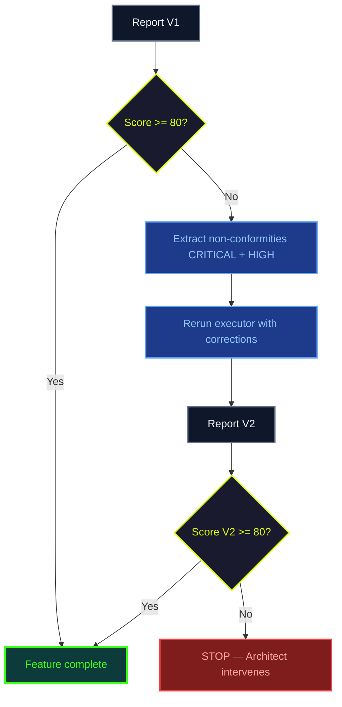

:::warning Maximum 2 iterations
Beyond 2 iterations, corrections tend to degrade code rather than improve it. The architect intervenes to arbitrate.
:::

<div class="validation-checkpoint">
<strong>Architect validation</strong> — the architect supervises the quality loop and takes over if the score remains insufficient after 2 iterations.
</div>

---

## Phase 4: Continuous Documentation

Unlike a traditional approach where documentation comes at the end, documentation here is **cross-cutting**: it can be generated or updated at **every phase** to maintain an always up-to-date documentation.

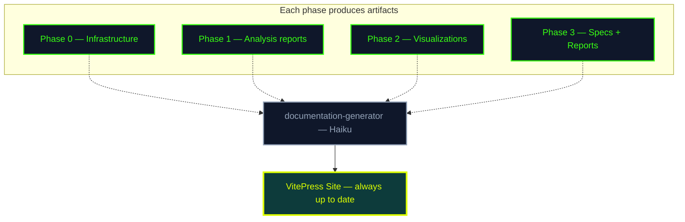

:::tip Incremental documentation
The `/modernization/generate-docs` command can be run at **any point** in the pipeline. Each execution incorporates the latest produced artifacts (reports, specs, conformity reports). The team thus has a living documentation that reflects the actual state of the migration.
:::

Haiku is sufficient because it's **structured Markdown** with a clear template — no complex reasoning needed.

<div class="validation-checkpoint">
<strong>Architect validation</strong> — the architect reviews generated documentation and validates before publication.
</div>

---

## How Agents Communicate

Agents are **isolated** — no shared memory. Their only communication channel: **intermediate files**.

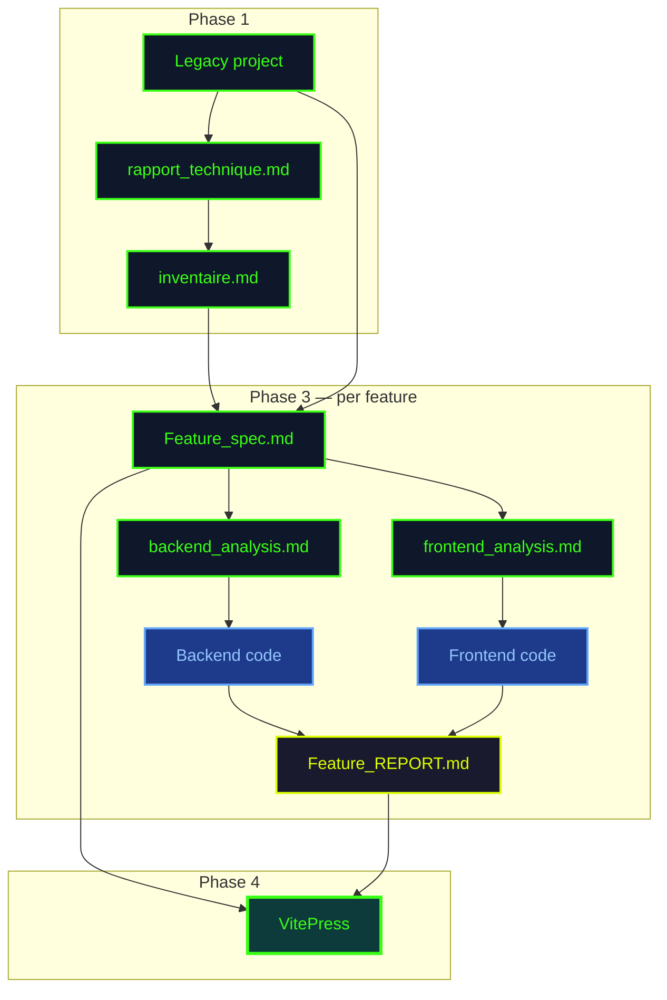

**Key benefit**: each step can be **replayed independently**. If implementation fails, restart at step 3 without redoing analysis or planning:

```bash
/modernization/migrate-feature Search_Engine stage=3
```

---

## Model Distribution

The principle: **use the cheapest model that produces the required quality**.

<div class="model-distribution">
  <div class="model-bar">
    <div class="model-segment opus" style="flex: 2;">
      <span class="model-label">Opus</span>
      <span class="model-count">2</span>
    </div>
    <div class="model-segment sonnet" style="flex: 7;">
      <span class="model-label">Sonnet</span>
      <span class="model-count">7</span>
    </div>
    <div class="model-segment haiku" style="flex: 3;">
      <span class="model-label">Haiku</span>
      <span class="model-count">3</span>
    </div>
  </div>
  <div class="model-legend">
    <span class="legend-item opus">Opus — deep analysis</span>
    <span class="legend-item sonnet">Sonnet — implementation</span>
    <span class="legend-item haiku">Haiku — light tasks</span>
  </div>
</div>

| Model | When | Agents |
|-------|------|--------|
| **Opus** | Raw undocumented code, complex reasoning | technical-analyzer, feature-analyzer |
| **Sonnet** | Spec as input, defined patterns, TDD | planners, executors, conformity-reporter, refiner, functional-analyzer |
| **Haiku** | Clear templates, simple checks | auditor, documentation-generator, health-check |

---

## Lessons Learned

| What we discovered | What we did |
|-------------------|------------|
| Opus is unnecessary when agent reads a report, not code | `functional-analyzer` switched from Opus to Sonnet |
| Conventions in agent prompts get ignored | Extracted into `references/` files in skills |
| Manual reviews vary in quality | Replaced with standardized deduction grid |
| Haiku refinement rephrases without enriching | `refiner` switched from Haiku to Sonnet |
| A rule alone can be bypassed | Double protection: rule + deny in settings.json |
| More than 2 correction iterations = degradation | Mandatory STOP + architect intervention |

---

## Resources

- [.claude/ Project Structure](/en/examples/project-structure) — Complete file organization
- [Migration Pipeline](/en/examples/pipeline) — Technical detail of each step
- [Model Strategy](/en/examples/model-strategy) — Opus/Sonnet/Haiku choices per agent
