<script setup>
import { withBase } from 'vitepress'
</script>

# AI-Driven Modernisation: Legacy Transmutation

> Transmute any legacy project into modern architecture — AI-powered, **architect/senior supervised** at every phase, driven by the Claude Code ecosystem.

## Target Technologies

This methodology is **source-technology agnostic**. It applies to any legacy migration, regardless of the original stack.

<div class="harness-note"><span class="hn-icon" aria-hidden="true"></span><div><strong class="hn-title">Modernisation harnesses</strong><p>We have modernisation harnesses for the target technologies listed below.</p><p class="hn-sub">Other technologies can also be supported, subject to a prior step of adapting or developing the appropriate harness.</p></div></div>

| Target | Typical stack |
|--------|-------------|
| **React** | Web SPA with TypeScript, Vite, Tailwind |
| **React Native** | Cross-platform mobile application |
| **Symfony** | PHP REST API backend, PostgreSQL, JWT |
| **NestJS / Node.js** | TypeScript REST API backend, microservices |

:::info Illustrated example
In this page, the concrete example is a **procedural PHP → Symfony 7.4 + React 19** migration. The principles and pipeline apply identically to other targets.
:::

---

## 3 Founding Principles

| Principle | In practice |
|-----------|-----------|
| **Understand before acting** | Never modify code without analyzing it in depth. Analysis produces written artifacts, not verbal summaries. |
| **The plan is a file** | Each step produces a Markdown file that serves as a relay to the next step. No shared context between agents. |
| **Implementation is mechanical** | All thinking happens in analysis and planning phases. Code follows specs and conventions. |

---

## Guardrails: ensuring functional conformity

> **Promise**: the modernized system does **exactly** what the legacy did.
> Six guardrails form a traceability chain from legacy code to modern code.

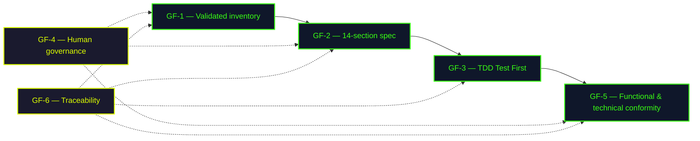
```mermaid
graph LR
    GF1["GF-1 — Validated inventory"]
    GF2["GF-2 — 14-section spec"]
    GF3["GF-3 — TDD Test First"]
    GF4["GF-4 — Human governance"]
    GF5["GF-5 — Functional & technical conformity"]
    GF6["GF-6 — Traceability"]

    GF1 --> GF2 --> GF3 --> GF5
    GF4 -.-> GF1
    GF4 -.-> GF2
    GF4 -.-> GF5
    GF6 -.-> GF1
    GF6 -.-> GF2
    GF6 -.-> GF3
    GF6 -.-> GF5

    classDef seq fill:#0f172a,stroke:#39ff14,stroke-width:2px,color:#39ff14
    classDef transversal fill:#1a1a2e,stroke:#ddff00,stroke-width:2px,color:#ddff00

    class GF1,GF2,GF3,GF5 seq
    class GF4,GF6 transversal
```

| # | Guardrail | Phase | What it guarantees |
|---|-----------|-------|--------------------|
| **GF-1** | **Human validation of the inventory: we implement what we validate** | Phase 1 | The client/PO confirms that 100% of features, roles and business flows are captured. Nothing is implemented without being validated. |
| **GF-2** | **14-section spec from legacy** | Phase 3 | Each feature is specified from legacy code. User scenarios, business rules, edge cases and testing considerations reflect existing behavior, each rule with its `file:line` source. Any behavior change is a deviation, arbitrated by a human before planning. Content of each section: [The 14 spec sections](#spec-sections). |
| **GF-3** | **TDD — Test First** | Phase 3 | Each spec scenario becomes a test **before** code. The test fails first (red), then code makes it pass (green). No legacy behavior is forgotten — if it's in the spec, it has a test. |
| **GF-4** | **Human governance** | All | Architect required at every phase. Client/PO validates functional aspects. Automatic STOP if the score stays < 80 after the correction pass (V2 report) — human takes over. |
| **GF-5** | **Functional and technical conformity** | Phase 3 | The conformity-reporter compares produced code against the spec (derived from legacy). Score < 80 = mandatory corrections. Versioned reports (V1, then V2 after correction), never overwritten. |
| **GF-6** | **Complete traceability** | All | Every artifact is a versioned file. You can trace any piece of code back to the legacy business rule that motivated it. |

---

## Human Oversight

Claude agents automate execution, but **structural decisions remain human**. Two complementary roles are involved throughout the process:

<div class="role-cards">
  <div class="role-card architect">
    <h4>Architect / Senior</h4>
    <ul>
      <li>Drives technical aspects and <strong>validates each phase</strong></li>
      <li>Defines conventions and target structure</li>
      <li>Decides migration order</li>
      <li>Supervises the quality loop</li>
      <li>Presence is <strong>mandatory</strong> throughout the process</li>
    </ul>
  </div>
  <div class="role-card client">
    <h4>Client / PO / Business</h4>
    <ul>
      <li>Guarantees <strong>functional fidelity</strong></li>
      <li>Validates inventory (features, roles, flows)</li>
      <li>Prioritizes features by business value</li>
      <li>Validates specs before implementation</li>
      <li>Presence <strong>strongly recommended</strong> (phases 1, 2, 3)</li>
    </ul>
  </div>
</div>

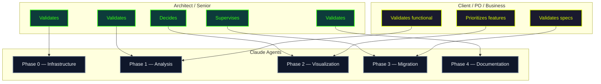
```mermaid
graph TB
    subgraph CLIENT["Client / PO / Business"]
        C1["Validates functional"]
        C2["Prioritizes features"]
        C3["Validates specs"]
    end

    subgraph ARCH["Architect / Senior"]
        V0["Validates"]
        V1["Validates"]
        V2["Decides"]
        V3["Supervises"]
        V4["Validates"]
    end

    subgraph AGENTS["Claude Agents"]
        A0["Phase 0 — Infrastructure"]
        A1["Phase 1 — Analysis"]
        A2["Phase 2 — Visualization"]
        A3["Phase 3 — Migration"]
        A4["Phase 4 — Documentation"]
    end

    V0 --> A0
    V1 --> A1
    V2 --> A2
    V3 --> A3
    V4 --> A4
    C1 --> A1
    C2 --> A2
    C3 --> A3

    classDef client fill:#1a1a2e,stroke:#ddff00,stroke-width:2px,color:#ddff00
    classDef arch fill:#0d3b3b,stroke:#39ff14,stroke-width:2px,color:#39ff14
    classDef agent fill:#0f172a,stroke:#64748b,stroke-width:2px,color:#f1f5f9

    class C1,C2,C3 client
    class V0,V1,V2,V3,V4 arch
    class A0,A1,A2,A3,A4 agent
```

| Phase | Architect / Senior | Client / PO / Business |
|-------|-------------------|----------------------|
| **Phase 0 — Infrastructure** | Defines target conventions, validates `.claude/` structure, chooses target technologies | — |
| **Phase 1 — Analysis** | Reviews the technical report, corrects interpretation errors | **Validates the inventory**: flags missed features, roles or rules |
| **Phase 2 — Visualization** | Decides the **migration order** based on technical dependencies | **Prioritizes** by business value, with the architect |
| **Phase 3 — Migration** | Arbitrates deviations and blocked tasks, reviews the plan, takes over if V2 < 80 | **Validates specs**: rules, scenarios, edge cases, deviations from the legacy |
| **Phase 4 — Documentation** | Reviews and validates technical documentation | Validates functional documentation |

:::warning Mandatory presence
An architect or senior's presence is **mandatory** throughout the entire process. Client / PO participation is **strongly recommended** in phases 1, 2 and 3 — this is the time to catch omissions and adjust before code is written. Agents are execution tools, not decision-makers. The human retains control over:
- Architecture choices and migration priorities
- Functional validation (feature completeness, business rules)
- Quality/deadline/scope trade-offs
:::

### The wiki as the steering dashboard {#wiki-steering}

The VitePress wiki generated by `/mod-generate-docs` (`WIKI_TARGET` folder) is the team's shared tracking point: everyone reads the state of the migration there without opening the files in `output/`.

**What is tracked:**
- **Progress per feature**: tasks done, to do and blocked (`Processed`, `Unprocessed`, `Blocked` in the backend and frontend analyses), state of each feature (planned, in progress, blocked, done…), features ready to migrate, deviations from the legacy still to be arbitrated.
- **Conformity scores** V1 and V2 of each evaluated feature.
- **The mapping**: dependency graph, migration waves (order derived from dependencies) and functional tree.
- **The batch timeline** of each feature and the modernisation **changelog** (one entry per event: spec, planning, batch, conformity).
- **The configuration inventory** of `.claude/` (agents, skills, rules, permissions) on the Claude Code Harness page.

**Who uses it:**

| Role | What they look for |
|------|--------------------|
| **Project manager** | Overall and per-feature progress, blocked tasks waiting for a decision |
| **Architect** | Specs and API / Frontend analyses, reviewed before implementation (the step 2 "architect validation", a team practice), then conformity scores |
| **Business** | Business rules in the specs and arbitrated deviations from the legacy (section 13 of each spec) |

**Why trust it**
- **No figure typed by hand**: indicators, timeline and mapping are computed from the project files (inventory, specs, task status, conformity reports).
- **Always up to date**: the pipeline updates the wiki at every key step, in the same commit as the code.
- **Result**: the dashboard reflects the repository exactly.

<CasUsageCards>
  <CasUsageCard page="modernisation/index.html#modernisation-—-vue-d-ensemble" title="Dashboard" desc="Progress per feature: tasks done, to do, blocked" />
  <CasUsageCard page="modernisation/index.html#resultats-verifies" title="Verified results" desc="Tests and conformity scores, measured" />
  <CasUsageCard page="mapping/index.html#cartographie-de-la-migration" title="Mapping" desc="Dependency graph, migration waves, functional tree" />
  <CasUsageCard page="modernisation/regions.html#timeline" title="Regions module timeline" desc="Each batch of 3 tasks, tested then committed" />
</CasUsageCards>

---

## Overview: 5 Phases

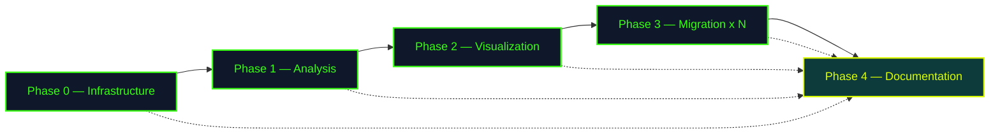
```mermaid
graph LR
    P0["Phase 0 — Infrastructure"]
    P1["Phase 1 — Analysis"]
    P2["Phase 2 — Visualization"]
    P3["Phase 3 — Migration x N"]
    P4["Phase 4 — Documentation"]

    P0 --> P1 --> P2 --> P3 --> P4

    P0 -.-> P4
    P1 -.-> P4
    P2 -.-> P4
    P3 -.-> P4

    classDef phase fill:#0f172a,stroke:#39ff14,stroke-width:2px,color:#39ff14
    classDef doc fill:#0d3b3b,stroke:#ddff00,stroke-width:2px,color:#ddff00

    class P0,P1,P2,P3 phase
    class P4 doc
```

---

## Phase 0: Build the Infrastructure

Before touching any code, we build the **declarative ecosystem** that will drive all agents.

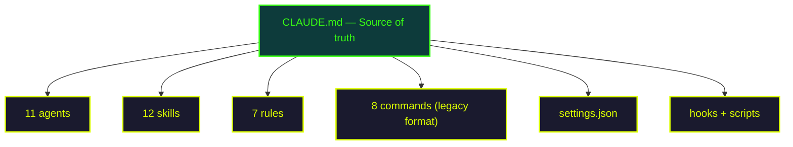
```mermaid
graph TB
    CM["CLAUDE.md — Source of truth"]

    CM --> AG["11 agents"]
    CM --> SK["12 skills"]
    CM --> RU["7 rules"]
    CM --> CO["8 commands (legacy format)"]
    CM --> SE["settings.json"]
    CM --> HK["hooks + scripts"]

    classDef source fill:#0d3b3b,stroke:#39ff14,stroke-width:2px,color:#39ff14
    classDef item fill:#1a1a2e,stroke:#ddff00,stroke-width:2px,color:#ddff00
    class CM source
    class AG,SK,RU,CO,SE,HK item
```

:::info Foundations we lay down
| Building block | Role |
|---|---|
| **CLAUDE.md** | Single source of paths (aliases): one place to change. `health-check` checks that the few hard-coded paths stay aligned. |
| **Skills** | Carry the conventions (backend, frontend, tests); each agent receives the ones it needs. |
| **Commands** | Everyday technical actions: tests, lint, commit (`/dev:…`), reviews (`/review:…`). |
| **Install script** | `/dev:install-stack` installs the target stacks; it overwrites nothing without your confirmation. |

**Three layers protect the project:**
- **Rule**: an instruction to the model ("the legacy is read-only"); it may not be followed, hence the next two layers.
- **Permissions** (`settings.json`): command allowlist; confirmation for destructive actions and commits; legacy write-protected, secrets (`.env`) neither read nor modified.
- **Hook**: blocks any recursive deletion, tested by a suite of cases.
:::

<div class="validation-checkpoint">
<strong>Validation</strong>
<div class="role-line"><span class="role-badge architecte">Architect</span><span>Validates the conventions, the configuration and the permissions.</span></div>
</div>

<CasUsageCards>
  <CasUsageCard page="modernisation/claude-harness.html#architecture" title=".claude/ structure" desc="Tree of the project configuration" />
  <CasUsageCard page="modernisation/claude-harness.html#agents" title="Agents" desc="Role, model and maxTurns of each agent" />
  <CasUsageCard page="modernisation/claude-harness.html#skills" title="Skills" desc="Launchers and preloaded conventions" />
  <CasUsageCard page="modernisation/claude-harness.html#permissions-settings-json" title="Permissions" desc="Allowlist, confirmations, denials" />
</CasUsageCards>

---

## Phase 1: Understand the Legacy

One command triggers three agents in sequence:


```mermaid
graph LR
    CMD["/mod-analyze-legacy"]
    T["Technical Analysis — Opus"]
    F["Functional Inventory — Sonnet"]
    A["Audit — Haiku"]
    OUT["Legacy understood"]

    CMD --> T
    T -->|"7 files output/technique/"| F
    F -->|"0-index.md + 0-features-tree.json"| A
    A -->|"enriched 0-index.md"| OUT

    classDef cmd fill:#0d3b3b,stroke:#39ff14,stroke-width:2px,color:#39ff14
    classDef opus fill:#1a1a2e,stroke:#ddff00,stroke-width:2px,color:#ddff00
    classDef sonnet fill:#1e3a8a,stroke:#60a5fa,stroke-width:2px,color:#93c5fd
    classDef haiku fill:#0f172a,stroke:#64748b,stroke-width:2px,color:#94a3b8
    classDef done fill:#0d3b3b,stroke:#39ff14,stroke-width:3px,color:#39ff14

    class CMD cmd
    class T opus
    class F sonnet
    class A haiku
    class OUT done
```

| Agent | Model | Role | Why this model |
|-------|-------|------|----------------|
| legacy-technical-analyzer | **Opus** | Reverse engineering raw code | Undocumented code, implicit architecture |
| legacy-functional-analyzer | **Sonnet** | Inventory of features/roles/flows | Reads the technical report, not raw code |
| legacy-functional-analyzer-auditor | **Haiku** | Completeness check | Simple comparison, no reasoning needed |

**Produced artifacts:**

```
output/technique/          (SOURCE_TECHNICAL_DIR — legacy-technical-analyzer)
├── 00-index.md            → Table of contents
├── 01-overview.md         → Overview, architecture
├── 02-data-flow.md        → Flows and logic
├── 03-database.md         → Database
├── 04-dependencies.md     → Dependencies
├── 05-deployment.md       → Deployment
└── 06-audit.md            → Quality audit and recommendations

output/features/           (FEATURE_SPECS_DIR — legacy-functional-analyzer)
├── 0-index.md             → Features, roles, business flows (enriched by the audit)
└── 0-features-tree.json   → Parent-child functional tree
```

**After the audit, the command continues with:**
- **Detailed specs** (optional): one Opus agent per feature, in parallel.
- **Visualizations**: mapping of the features and their dependencies.
- **Wiki synchronization.**

**Resume**: if the command stops, rerun it from the step you need (for example `/mod-analyze-legacy features`).

<div class="validation-checkpoint with-client">
<strong>Validation</strong>
<div class="role-line"><span class="role-badge architecte">Architect</span><span>Corrects the technical report.</span></div>
<div class="role-line"><span class="role-badge client">Client / PO</span><span>Validates the inventory: missed features, roles and rules. Correcting here costs far less than after implementation.</span></div>
</div>

<CasUsageCards>
  <CasUsageCard page="docs/analyses/overview.html#_2-architecture-de-haut-niveau" title="Legacy architecture" desc="High-level view of the existing code" />
  <CasUsageCard page="docs/analyses/database.html#_2-modele-de-donnees-erd" title="Data model" desc="ERD rebuilt from the legacy" />
  <CasUsageCard page="docs/analyses/data-flow.html#_1-flux-applicatif-principal" title="Application flow" desc="Main path of a request" />
  <CasUsageCard page="docs/analyses/audit.html#_6-4-plan-d-action-priorise" title="Audit" desc="Prioritised action plan" />
  <CasUsageCard page="docs/features/index.html#inventaire-des-features" title="Feature inventory" desc="Features, roles and flows identified" />
</CasUsageCards>

---

## Phase 2: Visualize to Decide

The inventory is transformed into **interactive visualizations** (standalone HTML with ECharts). The skill runs automatically as step 5 of `/mod-analyze-legacy` and can be rerun on its own after the inventory or the tree has been enriched (for example when refining a spec adds sub-features):

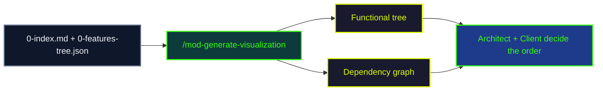
```mermaid
graph LR
    INV["0-index.md + 0-features-tree.json"]
    VIZ["/mod-generate-visualization"]
    T["Functional tree"]
    G["Dependency graph"]
    D["Architect + Client decide the order"]

    INV --> VIZ
    VIZ --> T
    VIZ --> G
    T --> D
    G --> D

    classDef input fill:#0f172a,stroke:#64748b,stroke-width:2px,color:#f1f5f9
    classDef cmd fill:#0d3b3b,stroke:#39ff14,stroke-width:2px,color:#39ff14
    classDef output fill:#1a1a2e,stroke:#ddff00,stroke-width:2px,color:#ddff00
    classDef decision fill:#1e3a8a,stroke:#39ff14,stroke-width:2px,color:#39ff14

    class INV input
    class VIZ cmd
    class T,G output
    class D decision
```

<div class="validation-checkpoint with-client">
<strong>Decision</strong>
<div class="role-line"><span class="role-badge architecte">Architect</span><span>Spots the features without dependencies, to migrate first.</span></div>
<div class="role-line"><span class="role-badge client">Client / PO</span><span>Prioritizes by business value. Together, they set the migration order.</span></div>
</div>

<CasUsageCards>
  <CasUsageCard page="mapping/index.html#cartographie-de-la-migration" title="Mapping" desc="Dependency graph, migration waves, functional tree" />
</CasUsageCards>

---

## Phase 3: Migrate Each Feature

This is the pipeline's core. For each feature:

```bash
/mod-migrate-feature Search_Engine
```

**The feature name** links all its files (spec, analyses, conformity report) and all the agents. It comes from the inventory (`User Authentication` becomes `User_Authentication`), and you can type it freely: `/mod-migrate-feature user-authentication` is enough. If it is not found or ambiguous, the launcher stops and asks you.

### At a Glance: 5 Core Steps, Framed by Steps 0 and 6


```mermaid
graph LR
    Z{"Step 0 — Target stacks present?"}
    INST["/dev:install-stack"]
    S["Step 1 — Specify — Opus"]
    P["Step 2 — Plan — Sonnet"]
    I["Step 3 — Implement — Sonnet"]
    C["Step 4 — Evaluate — Sonnet"]
    Q{"Step 5 — Score >= 80?"}
    FX["1 correction pass + V2 report"]
    Q2{"V2 score >= 80?"}
    STOP["STOP — architect"]
    OK["Feature migrated"]
    W["Step 6 — Wiki sync (/mod-generate-docs)"]

    Z -->|Yes| S
    Z -->|No| INST
    S --> P --> I --> C --> Q
    Q -->|Yes| OK
    Q -->|No| FX
    FX --> Q2
    Q2 -->|Yes| OK
    Q2 -->|No| STOP
    OK --> W

    classDef opus fill:#1a1a2e,stroke:#ddff00,stroke-width:2px,color:#ddff00
    classDef sonnet fill:#1e3a8a,stroke:#60a5fa,stroke-width:2px,color:#93c5fd
    classDef check fill:#0f172a,stroke:#39ff14,stroke-width:2px,color:#39ff14
    classDef done fill:#0d3b3b,stroke:#39ff14,stroke-width:3px,color:#39ff14

    classDef cmd fill:#0d3b3b,stroke:#39ff14,stroke-width:2px,color:#39ff14
    classDef stop fill:#7f1d1d,stroke:#ef4444,stroke-width:2px,color:#fca5a5

    class S opus
    class P,I,C,FX sonnet
    class Z,Q,Q2 check
    class OK done
    class INST,W cmd
    class STOP stop
```

**Before and after the 5 steps:**
- **Step 0**: the pipeline checks that the target stacks are installed; otherwise it stops and suggests `/dev:install-stack`.
- **Step 6**: it synchronizes the wiki. The wiki is also updated along the way, at every key step: see [The wiki as the steering dashboard](#wiki-steering).

<CasUsageCards>
  <CasUsageCard page="modernisation/index.html#modernisation-—-vue-d-ensemble" title="Dashboard" desc="Progress per feature: tasks done, to do, blocked" />
  <CasUsageCard page="modernisation/index.html#resultats-verifies" title="Verified results" desc="Tests and conformity scores, measured" />
</CasUsageCards>

---

### Step 1 — Specify (Opus)

The Opus agent produces a **14-section spec** from legacy code and the functional inventory. Its prompt contains only `Feature : <feature>`, never another spec: the agent starts from the legacy code alone.

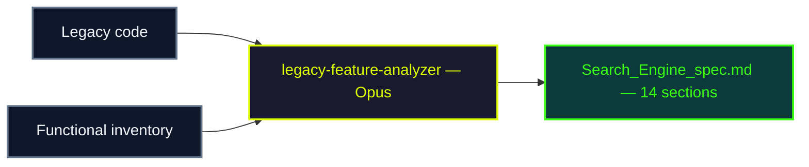
```mermaid
graph LR
    IN1["Legacy code"]
    IN2["Functional inventory"]
    FA["legacy-feature-analyzer — Opus"]
    SPEC["Search_Engine_spec.md — 14 sections"]

    IN1 --> FA
    IN2 --> FA
    FA --> SPEC

    classDef input fill:#0f172a,stroke:#64748b,stroke-width:2px,color:#f1f5f9
    classDef opus fill:#1a1a2e,stroke:#ddff00,stroke-width:2px,color:#ddff00
    classDef output fill:#0d3b3b,stroke:#39ff14,stroke-width:2px,color:#39ff14

    class IN1,IN2 input
    class FA opus
    class SPEC output
```

#### The 14 spec sections {#spec-sections}

The 14 sections (`## N. Title` headings from the `legacy-feature-analyzer` template, written in French) cover **every angle** of a feature. The Regions module spec from the use case serves as an example for each one:

| No. | Section (template heading) | What it contains | Real example |
|-----|----------------------------|------------------|--------------|
| 1 | Overview (`Vue d'Ensemble`) | Goal and business value, scope, user roles, analysis assumptions | <CasUsage page="docs/features/regions.html#sec-1">Regions module</CasUsage> |
| 2 | Source implementation reference (`Référence à l'Implémentation Source`) | Legacy stack, source files, internal and external dependencies, data models | <CasUsage page="docs/features/regions.html#sec-2">Regions module</CasUsage> |
| 3 | User scenarios (`Scénarios Utilisateur`) | Per scenario: actor, preconditions, main flow, alternative flows, postconditions | <CasUsage page="docs/features/regions.html#sec-3">Regions module</CasUsage> |
| 4 | Interaction points (`Points d'Interaction`) | UI components (fields, buttons, behaviors) and API endpoints, a contract transposed from the legacy (T-01, T-02, T-05) | <CasUsage page="docs/features/regions.html#sec-4">Regions module</CasUsage> |
| 5 | Business rules (`Règles Métier`) | Per rule: description, condition, enforcement, violation handling, example | <CasUsage page="docs/features/regions.html#sec-5">Regions module</CasUsage> |
| 6 | Data validation rules (`Règles de Validation des Données`) | Constraints and error messages per field, uniqueness, referential integrity | <CasUsage page="docs/features/regions.html#sec-6">Regions module</CasUsage> |
| 7 | State management (`Gestion de l'État`) | Application state, state transitions, persistent state (what, where, when) | <CasUsage page="docs/features/regions.html#sec-7">Regions module</CasUsage> |
| 8 | Access control & authorization (`Contrôle d'Accès & Autorisation`) | Permissions per action, visibility rules, data access (read, create, update, delete) | <CasUsage page="docs/features/regions.html#sec-8">Regions module</CasUsage> |
| 9 | Error handling (`Gestion des Erreurs`) | User-visible errors (message, cause, recovery) and system errors | <CasUsage page="docs/features/regions.html#sec-9">Regions module</CasUsage> |
| 10 | Edge cases & special scenarios (`Cas Limites & Scénarios Spéciaux`) | Per case: trigger, expected behavior, current legacy implementation | <CasUsage page="docs/features/regions.html#sec-10">Regions module</CasUsage> |
| 11 | Integration points (`Points d'Intégration`) | Internal (other features) and external (services) integrations | <CasUsage page="docs/features/regions.html#sec-11">Regions module</CasUsage> |
| 12 | Testing considerations (`Considérations pour les Tests`) | Critical scenarios, boundary conditions, negative cases, test data | <CasUsage page="docs/features/regions.html#sec-12">Regions module</CasUsage> |
| 13 | Migration notes (`Notes de Migration`) | Applied transpositions T-01 to T-07, **"Écarts au Legacy" table** (deviations, `Décision` column arbitrated by a human), technical challenges, legacy-specific patterns | <CasUsage page="docs/features/regions.html#sec-13">Regions module</CasUsage> |
| 14 | Appendix (`Annexe`) | Glossary, related features, identified sub-features (added to `0-features-tree.json`), source code references | <CasUsage page="docs/features/regions.html#sec-14">Regions module</CasUsage> |

A section that does not apply is not removed: it contains "Not applicable" and its justification. The launcher checks that the 14 sections are present, in order.

**Fidelity to the legacy**
- **Sections 1 to 12**: only the legacy behavior, each rule with its source in the code.
- **Allowed by default**: the technical changes required by the new stack, for example MySQL becoming PostgreSQL, or PHP pages becoming an API and a React application. They change nothing in the business behavior.
- **Any other change is a deviation** (added rule, fixed bug…), recorded in section 13. By default, the legacy is reproduced.

<p class="stop-note"><span><strong>The pipeline stops</strong> until every deviation has been arbitrated by a human: reproduce the legacy, or correct it.</span></p>

<div class="validation-checkpoint with-client">
<strong>Validation</strong>
<div class="role-line"><span class="role-badge architecte">Architect</span><span>Arbitrates every deviation from the legacy, with the client.</span></div>
<div class="role-line"><span class="role-badge client">Client / PO</span><span>Validates business rules, scenarios and edge cases: the last chance before planning.</span></div>
</div>

<CasUsageCards>
  <CasUsageCard page="docs/features/regions.html#sec-1" title="Regions module spec" desc="14 sections drawn from the legacy code" />
  <CasUsageCard page="docs/features/regions.html#sec-13" title="Arbitrated deviations" desc="Section 13: deviations from the legacy and decisions" />
</CasUsageCards>

---

### Step 2 — Plan (Sonnet)

Two planners split the spec into **numbered tasks with dependencies**. The backend goes first and defines the API contract; the frontend builds on that contract:

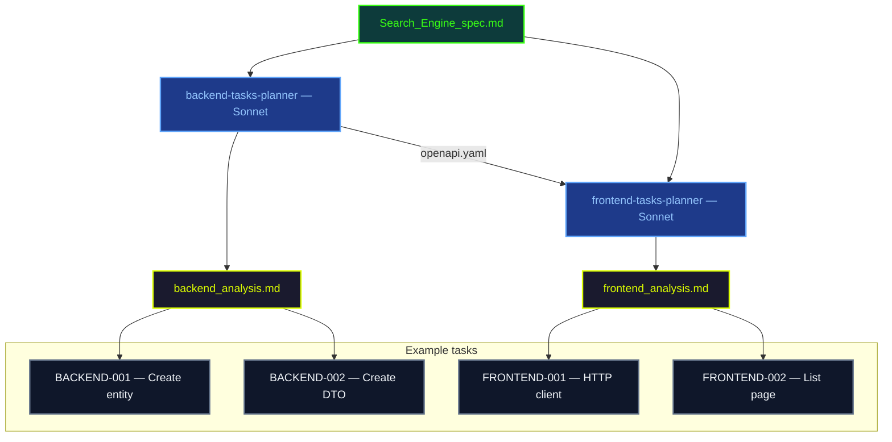
```mermaid
graph TB
    SPEC["Search_Engine_spec.md"]
    BP["backend-tasks-planner — Sonnet"]
    FP["frontend-tasks-planner — Sonnet"]
    BA["backend_analysis.md"]
    FA["frontend_analysis.md"]

    SPEC --> BP
    SPEC --> FP
    BP --> BA
    BP -->|openapi.yaml| FP
    FP --> FA

    subgraph TASKS["Example tasks"]
        T1["BACKEND-001 — Create entity"]
        T2["BACKEND-002 — Create DTO"]
        T3["FRONTEND-001 — HTTP client"]
        T4["FRONTEND-002 — List page"]
    end

    BA --> T1
    BA --> T2
    FA --> T3
    FA --> T4

    classDef input fill:#0d3b3b,stroke:#39ff14,stroke-width:2px,color:#39ff14
    classDef sonnet fill:#1e3a8a,stroke:#60a5fa,stroke-width:2px,color:#93c5fd
    classDef output fill:#1a1a2e,stroke:#ddff00,stroke-width:2px,color:#ddff00
    classDef task fill:#0f172a,stroke:#64748b,stroke-width:2px,color:#f1f5f9

    class SPEC input
    class BP,FP sonnet
    class BA,FA output
    class T1,T2,T3,T4 task
```

Each task contains:
- A **unique ID** and a title (`#### BACKEND-001 : <title>`)
- Its **dependencies** (`Dépend de`: which tasks must complete first)
- A **Status** (`Unprocessed`, then `Processed` or `Blocked`)
- A legacy **source reference** (file, lines)
- Precise **acceptance criteria**

Conventions are not copied task by task: planners and executors receive them through preloaded skills (the `skills:` field of their frontmatter).

<div class="validation-checkpoint">
<strong>Recommended validation (the pipeline does not stop)</strong>
<div class="role-line"><span class="role-badge architecte">Architect</span><span>Reviews the task plan before implementation, and interrupts if needed.</span></div>
</div>

<CasUsageCards>
  <CasUsageCard page="modernisation/api/regions.html#liste-des-taches-backend" title="Regions module backend tasks" desc="Numbered tasks, dependencies, status" />
  <CasUsageCard page="modernisation/api/regions.html#specification-openapi" title="OpenAPI contract" desc="Planned endpoints, the frontend's basis" />
  <CasUsageCard page="modernisation/frontend/regions.html#liste-des-taches-frontend" title="Regions module frontend tasks" desc="Numbered tasks, dependencies, status" />
</CasUsageCards>

---

### Step 3 — Implement with TDD (Sonnet)

Executors implement each task **Test First**:

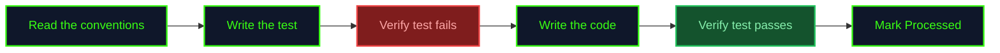
```mermaid
graph LR
    R["Read the conventions"]
    T["Write the test"]
    F["Verify test fails"]
    I["Write the code"]
    P["Verify test passes"]
    M["Mark Processed"]

    R --> T --> F --> I --> P --> M

    classDef step fill:#0f172a,stroke:#39ff14,stroke-width:2px,color:#39ff14
    classDef fail fill:#7f1d1d,stroke:#ef4444,stroke-width:2px,color:#fca5a5
    classDef pass fill:#14532d,stroke:#22c55e,stroke-width:2px,color:#86efac

    class R,T,I,M step
    class F fail
    class P pass
```

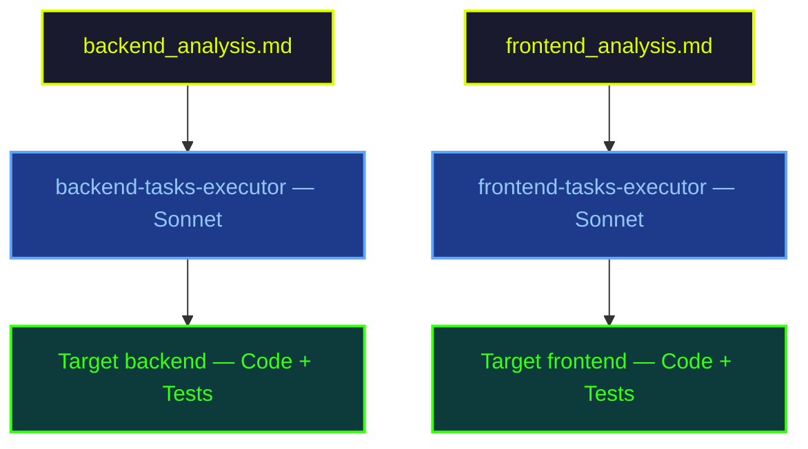
```mermaid
graph TB
    BA["backend_analysis.md"]
    FA["frontend_analysis.md"]
    BE["backend-tasks-executor — Sonnet"]
    FE["frontend-tasks-executor — Sonnet"]
    SYM["Target backend — Code + Tests"]
    FRONT["Target frontend — Code + Tests"]

    BA --> BE
    FA --> FE
    BE --> SYM
    FE --> FRONT

    classDef input fill:#1a1a2e,stroke:#ddff00,stroke-width:2px,color:#ddff00
    classDef sonnet fill:#1e3a8a,stroke:#60a5fa,stroke-width:2px,color:#93c5fd
    classDef output fill:#0d3b3b,stroke:#39ff14,stroke-width:2px,color:#39ff14

    class BA,FA input
    class BE,FE sonnet
    class SYM,FRONT output
```

**Skills, the guardrails for conventions**: agents don't guess the coding rules. They receive the project's conventions (backend or frontend), with examples to follow. Every feature is therefore written the same way.

**How implementation progresses**
- **In small batches**: tasks are handled 3 at a time.
- **Each batch is tested**, then committed with your approval.
- **At the end**, the feature's documentation is generated.

<p class="stop-note"><span><strong>The pipeline stops</strong> if a task is blocked: it shows you the problem and the proposed solution, and you decide.</span></p>

<p class="stop-note"><span><strong>The pipeline stops</strong> if the tests fail: fix them, then rerun.</span></p>

**Resume**: after an interruption, rerun the same command; the last batch is tested again before continuing.

::: info In our project
Agents never commit on their own: the pipeline commits each verified batch, with your approval, and updates the wiki in the same commit.
:::

<CasUsageCards>
  <CasUsageCard page="modernisation/regions.html#timeline" title="Regions module timeline" desc="Each batch of 3 tasks, tested then committed" />
  <CasUsageCard page="modernisation/changelog.html#journal-de-modernisation" title="Changelog" desc="The migration steps, in order" />
</CasUsageCards>

---

### Step 4 — Evaluate Conformity (Sonnet) {#step-4}

The agent **objectively scores** code against the spec:

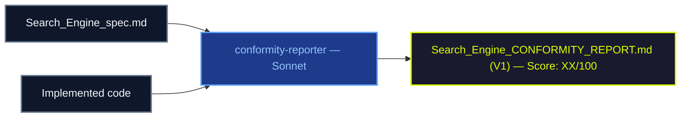
```mermaid
graph LR
    SPEC["Search_Engine_spec.md"]
    CODE["Implemented code"]
    CR["conformity-reporter — Sonnet"]
    REPORT["Search_Engine_CONFORMITY_REPORT.md (V1) — Score: XX/100"]

    SPEC --> CR
    CODE --> CR
    CR --> REPORT

    classDef input fill:#0f172a,stroke:#64748b,stroke-width:2px,color:#f1f5f9
    classDef sonnet fill:#1e3a8a,stroke:#60a5fa,stroke-width:2px,color:#93c5fd
    classDef output fill:#1a1a2e,stroke:#ddff00,stroke-width:2px,color:#ddff00

    class SPEC,CODE input
    class CR sonnet
    class REPORT output
```

**How the score is calculated**

Each report section starts at **100 points**. Points are removed for each problem found, according to its severity:

| Severity | Points removed | Example |
|---|---|---|
| Critical | −15 | Missing API endpoint |
| High | −10 | Pagination not implemented |
| Medium | −5 (at most 25 per section) | Relevance sorting absent |
| Low | −2 (at most 10 per section) | Non-conforming naming |

**The overall score** combines 4 criteria:
- **project conventions**: 30%;
- **consistency with the existing code**: 25%;
- **compliance with the spec**: 25%;
- **alignment with the analyses**: 20%.

**Reports are never overwritten**: V1 after implementation, V2 after the correction pass. The pipeline stops at V2.

<CasUsageCards>
  <CasUsageCard page="modernisation/conformity-categories.html#score-global" title="Conformity score" desc="Categories module report: overall score" />
  <CasUsageCard page="modernisation/conformity-categories.html#tableau-de-bord" title="Scores per section" desc="Breakdown of the report's scoring" />
</CasUsageCards>

---

### Step 5 — Quality Loop (LLM-as-Judge) {#step-5}

The score determines what happens next:

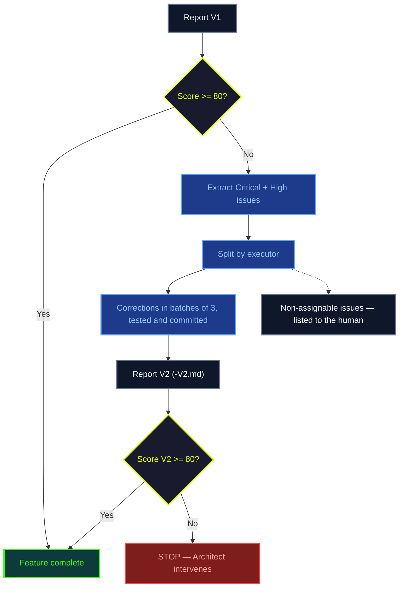
```mermaid
graph TB
    R["Report V1"]
    CHECK{"Score >= 80?"}
    OK["Feature complete"]
    FIX["Extract Critical + High issues"]
    SPLIT["Split by executor"]
    HUM["Non-assignable issues — listed to the human"]
    EXEC["Corrections in batches of 3, tested and committed"]
    R2["Report V2 (-V2.md)"]
    CHECK2{"Score V2 >= 80?"}
    STOP["STOP — Architect intervenes"]

    R --> CHECK
    CHECK -->|Yes| OK
    CHECK -->|No| FIX
    FIX --> SPLIT
    SPLIT --> EXEC
    SPLIT -.-> HUM
    EXEC --> R2
    R2 --> CHECK2
    CHECK2 -->|Yes| OK
    CHECK2 -->|No| STOP

    classDef input fill:#0f172a,stroke:#64748b,stroke-width:2px,color:#f1f5f9
    classDef check fill:#1a1a2e,stroke:#ddff00,stroke-width:2px,color:#ddff00
    classDef ok fill:#0d3b3b,stroke:#39ff14,stroke-width:3px,color:#39ff14
    classDef fix fill:#1e3a8a,stroke:#60a5fa,stroke-width:2px,color:#93c5fd
    classDef stop fill:#7f1d1d,stroke:#ef4444,stroke-width:2px,color:#fca5a5

    class R,R2,HUM input
    class CHECK,CHECK2 check
    class OK ok
    class FIX,SPLIT,EXEC fix
    class STOP stop
```

**How the correction works**
- **Serious problems** (critical and high) from the V1 report are assigned to the backend or frontend agents according to where they are.
- **As in implementation**: in small batches, each batch tested then committed.
- **What no agent can fix** (spec, analyses) is presented to you.
- **Once everything is fixed**, the V2 report measures the result.

:::warning A single correction pass
Beyond one pass, corrections tend to degrade code rather than improve it: if the V2 stays below 80/100, the pipeline stops and the architect arbitrates.
:::

<div class="validation-checkpoint">
<strong>Validation</strong>
<div class="role-line"><span class="role-badge architecte">Architect</span><span>Takes over if the V2 score stays below 80/100.</span></div>
</div>

<CasUsageCards>
  <CasUsageCard page="modernisation/conformity-categories.html#decision" title="Decision" desc="The report's verdict and next step" />
  <CasUsageCard page="modernisation/conformity-categories.html#suivi-v1-→-v2-section-11-4-anticipee" title="V1 → V2 follow-up" desc="What the correction pass changed" />
</CasUsageCards>

---

## Phase 4: Continuous Documentation

Unlike a traditional approach where documentation comes at the end, documentation here is **cross-cutting**: it can be generated or updated at **every phase** to maintain an always up-to-date documentation.

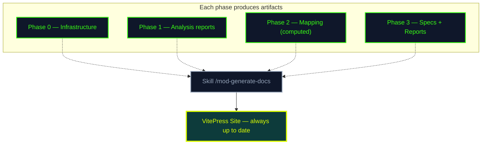
```mermaid
graph TB
    subgraph PHASES["Each phase produces artifacts"]
        P0["Phase 0 — Infrastructure"]
        P1["Phase 1 — Analysis reports"]
        P2["Phase 2 — Mapping (computed)"]
        P3["Phase 3 — Specs + Reports"]
    end

    D["Skill /mod-generate-docs"]
    V["VitePress Site — always up to date"]

    P0 -.-> D
    P1 -.-> D
    P2 -.-> D
    P3 -.-> D
    D --> V

    classDef phase fill:#0f172a,stroke:#39ff14,stroke-width:2px,color:#39ff14
    classDef haiku fill:#0f172a,stroke:#94a3b8,stroke-width:2px,color:#94a3b8
    classDef output fill:#0d3b3b,stroke:#ddff00,stroke-width:3px,color:#ddff00

    class P0,P1,P2,P3 phase
    class D haiku
    class V output
```

:::tip Real example
The *Classified Ads* use case wiki: <a :href="withBase('/exemple-wiki-legacy/')" target="_blank" rel="noopener">real use case (wiki) ↗</a>.
:::

**How the wiki is produced**
- **A single command**, `/mod-generate-docs`, generates the whole wiki or a single feature.
- **Automatic**: the pipeline runs it at every key step; it can also be run at any time.
- **Computed figures, never typed**: dashboard, mapping and timeline come from the project files.

What the team follows there: see [The wiki as the steering dashboard](#wiki-steering).

<CasUsageCards>
  <CasUsageCard page="modernisation/index.html#modernisation-—-vue-d-ensemble" title="Dashboard" desc="Progress per feature: tasks done, to do, blocked" />
  <CasUsageCard page="modernisation/index.html#pages" title="Modernisation pages" desc="One page per feature: spec, analyses, timeline, report" />
  <CasUsageCard page="docs/index.html#analyses-techniques" title="Legacy analyses" desc="Technical analyses and specifications" />
</CasUsageCards>

<div class="validation-checkpoint">
<strong>Validation</strong>
<div class="role-line"><span class="role-badge architecte">Architect</span><span>Reviews and validates the documentation before publication.</span></div>
</div>

---

## How Agents Communicate

Each agent works in **its own context**: it sees neither the main conversation nor the other agents. They therefore communicate through **files**: one writes, the next reads.

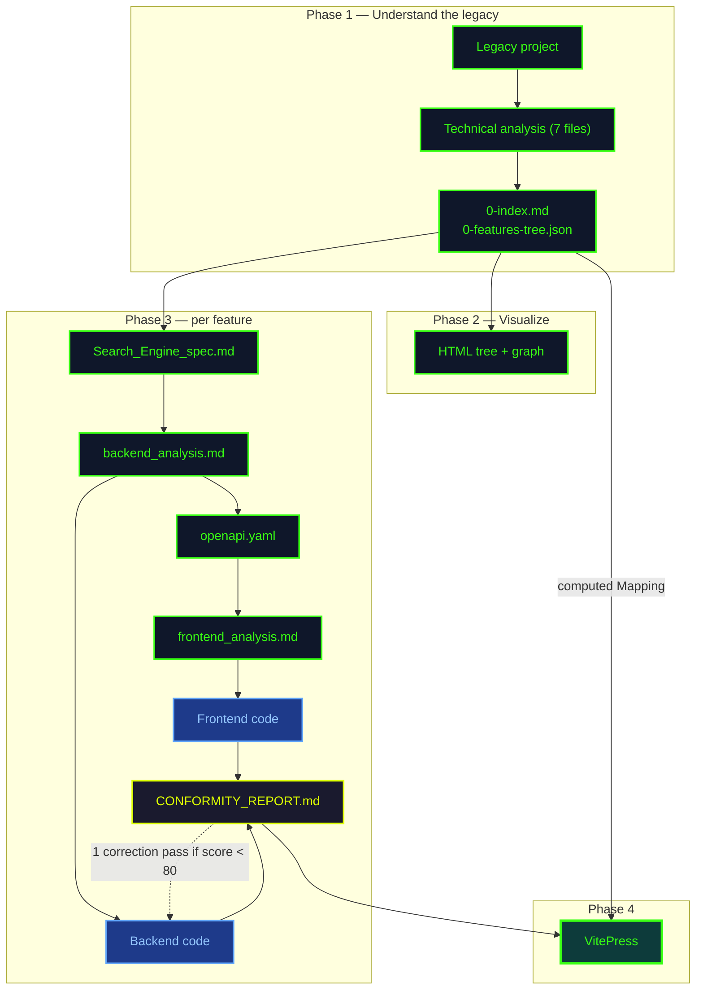
```mermaid
graph TB
    subgraph P1["Phase 1 — Understand the legacy"]
        LEGACY["Legacy project"]
        TECH["Technical analysis (7 files)"]
        INV["0-index.md<br/>0-features-tree.json"]
        LEGACY --> TECH --> INV
    end

    subgraph P2["Phase 2 — Visualize"]
        VIZ["HTML tree + graph"]
    end

    subgraph P3["Phase 3 — per feature"]
        SPEC["Search_Engine_spec.md"]
        BACK["backend_analysis.md"]
        OAS["openapi.yaml"]
        FRONT["frontend_analysis.md"]
        CODE_B["Backend code"]
        CODE_F["Frontend code"]
        REPORT["CONFORMITY_REPORT.md"]

        SPEC --> BACK --> OAS --> FRONT
        BACK --> CODE_B
        FRONT --> CODE_F
        CODE_B --> REPORT
        CODE_F --> REPORT
        REPORT -. "1 correction pass if score < 80" .-> CODE_B
    end

    subgraph P4["Phase 4"]
        DOCS["VitePress"]
    end

    INV --> VIZ
    INV --> SPEC
    INV -->|"computed Mapping"| DOCS
    REPORT --> DOCS

    classDef file fill:#0f172a,stroke:#39ff14,stroke-width:2px,color:#39ff14
    classDef code fill:#1e3a8a,stroke:#60a5fa,stroke-width:2px,color:#93c5fd
    classDef report fill:#1a1a2e,stroke:#ddff00,stroke-width:2px,color:#ddff00
    classDef output fill:#0d3b3b,stroke:#39ff14,stroke-width:3px,color:#39ff14

    class LEGACY,TECH,INV,VIZ,SPEC,BACK,OAS,FRONT file
    class CODE_B,CODE_F code
    class REPORT report
    class DOCS output
```

Two files play a special role:
- **`openapi.yaml`** is the contract between backend and frontend: backend planning produces it, frontend planning builds on it.
- **The conformity report** is the only feedback loop in the flow: if the score is below 80/100, its critical and high issues go back once to the relevant executor, then a V2 report is produced.

<p class="key-note"><span><strong>Key benefit</strong>: each step checks its files before continuing. On failure, rerun the same command: the pipeline resumes where it stopped, without redoing what is already validated.</span></p>

```bash
/mod-migrate-feature Search_Engine
```

---

## Model Distribution

The principle: **the cheapest model that produces the required quality**. General strategy: [Which model to choose](/en/concepts/agents#which-model-to-choose).

<div class="model-distribution">
  <div class="model-bar">
    <div class="model-segment opus" style="flex: 2;">
      <span class="model-label">Opus</span>
      <span class="model-count">2</span>
    </div>
    <div class="model-segment sonnet" style="flex: 7;">
      <span class="model-label">Sonnet</span>
      <span class="model-count">7</span>
    </div>
    <div class="model-segment haiku" style="flex: 2;">
      <span class="model-label">Haiku</span>
      <span class="model-count">2</span>
    </div>
  </div>
  <div class="model-legend">
    <span class="legend-item opus">Opus — deep analysis</span>
    <span class="legend-item sonnet">Sonnet — implementation</span>
    <span class="legend-item haiku">Haiku — light tasks</span>
  </div>
</div>

| Model | When | Agents |
|-------|------|--------|
| **Opus** | Raw undocumented code, complex reasoning | technical-analyzer, feature-analyzer |
| **Sonnet** | Spec as input, defined patterns, TDD | planners, executors, conformity-reporter, refiner, functional-analyzer |
| **Haiku** | Clear templates, simple checks | functional-analyzer-auditor, health-check |

- **Sonnet is enough** for the functional inventory, which reads the technical report, not raw code.
- **Sonnet too** to enrich an existing spec, which takes more than rephrasing.
- **Each agent has a turn limit** suited to its task; the implementation agents' limit is sized for a batch of 3 tasks.

---

## Resources

- [.claude/ Project Structure](/en/examples/project-structure) — Complete file organization
- [Migration Pipeline](/en/examples/pipeline) — Technical detail of each step
- [Model Strategy](/en/examples/model-strategy) — Opus/Sonnet/Haiku choices per agent
- [How I Use Claude Code](https://boristane.com/blog/how-i-use-claude-code/) — Boris Tane: research, annotated plan, then implementation

---

*Checked with **Claude Code v2.1.295** against the official documentation on October 10, 2026. A newer feature may be missing: see the [changelog](https://code.claude.com/docs/en/changelog).*
