# AI-Driven Modernisation : Legacy Transmutation

> Transformer n'importe quel projet legacy en architecture moderne — piloté par l'IA, **supervisé par un architecte/senior** à chaque phase, propulsé par l'écosystème Claude Code.

## Technologies cibles

Cette méthodologie est **agnostique de la technologie source**. Elle s'applique à toute migration legacy, quelle que soit la stack d'origine.

| Cible | Stack type |
|-------|-----------|
| **React** | SPA web avec TypeScript, Vite, Tailwind |
| **React Native** | Application mobile cross-platform |
| **Symfony** | API REST backend PHP, PostgreSQL, JWT |
| **NestJS / Node.js** | API REST backend TypeScript, microservices |

:::info Exemple illustré
Dans cette page, l'exemple concret est une migration **PHP procédural → Symfony 7.4 + React 19**. Les principes et le pipeline s'appliquent identiquement aux autres cibles.
:::

---

## Les 3 principes fondateurs

| Principe | En pratique |
|----------|-----------|
| **Comprendre avant d'agir** | Ne jamais modifier du code sans l'avoir analysé en profondeur. L'analyse produit des artefacts écrits, pas des résumés verbaux. |
| **Le plan est un fichier** | Chaque étape produit un fichier Markdown qui sert de relais vers l'étape suivante. Pas de contexte partagé entre agents. |
| **L'implémentation est mécanique** | Toute la réflexion a lieu dans les phases d'analyse et de planification. Le code suit les specs et les conventions. |

---

## Garde-fous : garantir la conformité fonctionnelle

> **Promesse** : le système modernisé fait **exactement** ce que le legacy faisait.
> Six garde-fous forment une chaîne de traçabilité du code legacy au code moderne.

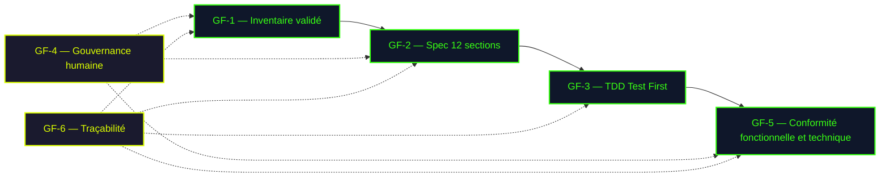

| # | Garde-fou | Phase | Ce qu'il garantit |
|---|-----------|-------|-------------------|
| **GF-1** | **Validation humaine de l'inventaire : on implémente ce qu'on valide** | Phase 1 | Le client/PO confirme que 100% des features, rôles et flux métier sont capturés. Rien n'est implémenté sans avoir été validé. |
| **GF-2** | **Spec en 12 sections depuis le legacy** | Phase 3 | Chaque feature est spécifiée à partir du code legacy. Les scénarios utilisateur et critères d'acceptation reflètent le comportement existant. |
| **GF-3** | **TDD — Test First** | Phase 3 | Chaque scénario de la spec devient un test **avant** le code. Le test échoue d'abord (red), le code le fait passer (green). Aucun comportement legacy n'est oublié — s'il est dans la spec, il a un test. |
| **GF-4** | **Gouvernance humaine** | Toutes | Architecte obligatoire à chaque phase. Client/PO valide le fonctionnel. STOP automatique si score < 80 après 2 itérations — l'humain reprend la main. |
| **GF-5** | **Conformité fonctionnelle et technique** | Phase 3 | Le conformity-reporter compare le code produit à la spec (dérivée du legacy). Score < 80 = corrections obligatoires. Rapports versionnés (V1, V2, V3). |
| **GF-6** | **Traçabilité complète** | Toutes | Chaque artefact est un fichier versionné. On peut remonter de n'importe quel bout de code à la règle métier legacy qui l'a motivé. |

---

## Le pilotage humain

Les agents Claude automatisent l'exécution, mais les **décisions structurantes restent humaines**. Deux rôles complémentaires interviennent tout au long du processus :

<div class="role-cards">
  <div class="role-card architect">
    <h4>Architecte / Senior</h4>
    <ul>
      <li>Pilote techniquement et <strong>valide chaque phase</strong></li>
      <li>Définit les conventions et la structure cible</li>
      <li>Décide de l'ordre de migration</li>
      <li>Supervise la boucle qualité</li>
      <li>Présence <strong>obligatoire</strong> tout au long du processus</li>
    </ul>
  </div>
  <div class="role-card client">
    <h4>Client / PO / Métier</h4>
    <ul>
      <li>Garantit la <strong>fidélité fonctionnelle</strong></li>
      <li>Valide l'inventaire (features, rôles, flux)</li>
      <li>Priorise les features par valeur métier</li>
      <li>Valide les specs avant implémentation</li>
      <li>Présence <strong>fortement recommandée</strong> (phases 1, 2, 3)</li>
    </ul>
  </div>
</div>

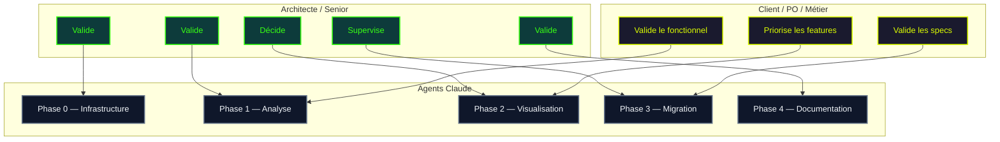

| Phase | Architecte / Senior | Client / PO / Métier |
|-------|--------------------|--------------------|
| **Phase 0 — Infrastructure** | Définit les conventions, valide la structure `.claude/`, choisit les technologies cibles | — |
| **Phase 1 — Analyse** | Relit le rapport technique, corrige les erreurs d'interprétation | **Valide l'inventaire fonctionnel** : vérifie que toutes les features, rôles et flux métier sont présents. Signale les oublis ou les règles implicites que l'IA ne peut pas déduire du code |
| **Phase 2 — Visualisation** | Décide de l'**ordre de migration** en fonction des dépendances techniques | **Priorise les features** selon la valeur métier. Arbitre avec l'architecte sur l'ordre final |
| **Phase 3 — Migration** | Approuve le plan de tâches, supervise la boucle qualité, intervient si score < 80 après 2 itérations | **Valide les specs** (12 sections) : vérifie les règles métier, les scénarios utilisateur et les critères d'acceptation avant l'implémentation |
| **Phase 4 — Documentation** | Relit et valide la documentation technique | Valide la documentation fonctionnelle |

:::warning Présence obligatoire
La présence d'un architecte ou senior est **obligatoire** tout au long du processus. La participation du client / PO est **fortement recommandée** aux phases 1, 2 et 3 — c'est le moment de détecter les oublis et d'ajuster avant que le code ne soit écrit. Les agents sont des outils d'exécution, pas des décideurs. L'humain garde le contrôle sur :
- Les choix d'architecture et les priorités de migration
- La validation fonctionnelle (complétude des features, règles métier)
- Les arbitrages qualité/délai/périmètre
:::

---

## Vue d'ensemble : 5 phases

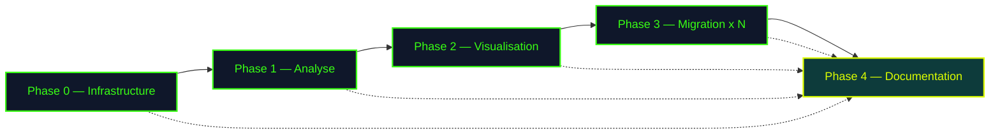

---

## Phase 0 : Construire l'infrastructure

Avant de toucher au code, on construit l'**écosystème déclaratif** qui pilotera tous les agents.

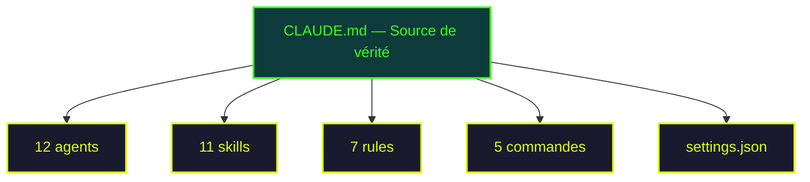

:::info Ce qu'on pose comme fondations
- **CLAUDE.md** centralise tous les chemins — un seul endroit à modifier
- **Rules** protègent le legacy en lecture seule (double couche : rule + deny)
- **Skills** portent les conventions — les agents les héritent automatiquement
- **Settings** autorisent Docker et git sans confirmation
:::

<div class="validation-checkpoint">
<strong>Validation architecte</strong> — L'architecte définit les conventions cibles, valide la structure <code>.claude/</code> et les permissions avant de lancer la phase suivante.
</div>

---

## Phase 1 : Comprendre le legacy

On lance une seule commande. Trois agents se relaient :

```mermaid
graph LR
    CMD["/analyze-legacy"]
    T["Analyse technique — Opus"]
    F["Inventaire fonctionnel — Sonnet"]
    A["Audit — Haiku"]
    OUT["Legacy compris"]

    CMD --> T
    T -->|rapport_technique.md| F
    F -->|inventaire.md| A
    A -->|inventaire enrichi| OUT

    classDef cmd fill:#0d3b3b,stroke:#39ff14,stroke-width:2px,color:#39ff14
    classDef opus fill:#1a1a2e,stroke:#ddff00,stroke-width:2px,color:#ddff00
    classDef sonnet fill:#1e3a8a,stroke:#60a5fa,stroke-width:2px,color:#93c5fd
    classDef haiku fill:#0f172a,stroke:#64748b,stroke-width:2px,color:#94a3b8
    classDef done fill:#0d3b3b,stroke:#39ff14,stroke-width:3px,color:#39ff14

    class CMD cmd
    class T opus
    class F sonnet
    class A haiku
    class OUT done
```

| Agent | Modèle | Rôle | Pourquoi ce modèle |
|-------|--------|------|-------------------|
| technical-analyzer | **Opus** | Reverse engineering du code brut | Code non documenté, architecture implicite |
| functional-analyzer | **Sonnet** | Inventaire features/rôles/flux | Lit le rapport technique, pas du code brut |
| functional-auditor | **Haiku** | Vérifie la complétude | Simple comparaison, pas de raisonnement |

**Artefacts produits :**

```
output/technique/
├── rapport_technique.md      → Architecture, DB, dépendances
├── inventaire_fonctionnel.md → Features, rôles, flux métier
└── arbre_fonctionnel.md      → Hiérarchie parent-enfant
```

<div class="validation-checkpoint with-client">
<strong>Validation architecte + client</strong> — L'architecte relit le rapport technique et corrige les erreurs d'interprétation. Le client / PO valide l'inventaire fonctionnel — c'est le moment clé pour détecter les features oubliées, les rôles manquants ou les règles métier implicites que l'IA n'a pas pu déduire du code. Ces ajustements sont <strong>bien moins coûteux ici</strong> qu'après l'implémentation.
</div>

---

## Phase 2 : Visualiser pour décider

L'inventaire est transformé en **visualisations interactives** (HTML standalone avec ECharts) :

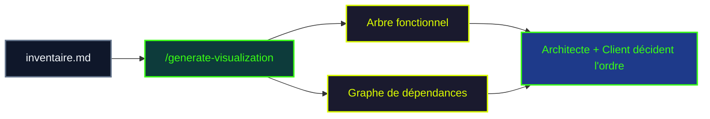

<div class="validation-checkpoint with-client">
<strong>Décision architecte + client</strong> — L'architecte identifie les <strong>features indépendantes</strong> (pas de dépendances techniques) à migrer en premier. Le client priorise selon la <strong>valeur métier</strong>. Ensemble, ils définissent la roadmap de migration — ce qui garantit que les features les plus critiques pour le business sont livrées en premier.
</div>

---

## Phase 3 : Migrer chaque feature

C'est le coeur du pipeline. Pour chaque feature, on lance :

```bash
/modernization/migrate-feature Search_Engine
```

### Vue d'ensemble des 5 étapes

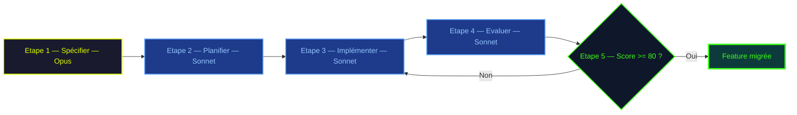

---

### Étape 1 — Spécifier (Opus)

L'agent Opus produit une **spec en 12 sections** à partir du code legacy et de l'inventaire fonctionnel.

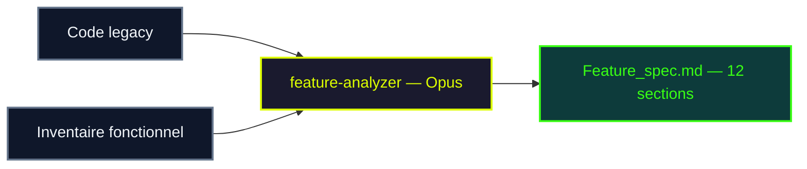

Les 12 sections couvrent **tous les angles** d'une feature :

```
┌─────────────────────────┬─────────────────────────┐
│ 1. Vue d'ensemble       │  7. Gestion d'erreurs   │
│ 2. Référence legacy     │  8. Sécurité            │
│ 3. Scénarios utilisateur│  9. Dépendances         │
│ 4. Interface (UI)       │ 10. Données             │
│ 5. Règles métier        │ 11. Performance         │
│ 6. Validation           │ 12. Critères acceptance │
└─────────────────────────┴─────────────────────────┘
```

<div class="validation-checkpoint with-client">
<strong>Validation architecte + client</strong> — L'architecte vérifie la cohérence technique (dépendances, données, performance). Le client valide les <strong>règles métier, les scénarios utilisateur et les critères d'acceptation</strong> — dernière opportunité de corriger avant la planification. Si nécessaire, l'agent <code>refiner</code> (Sonnet) affine la spec — le fichier corrigé est suffixé <code>-corrected</code>.
</div>

---

### Étape 2 — Planifier (Sonnet)

Deux planners décomposent la spec en **tâches numérotées avec dépendances** :

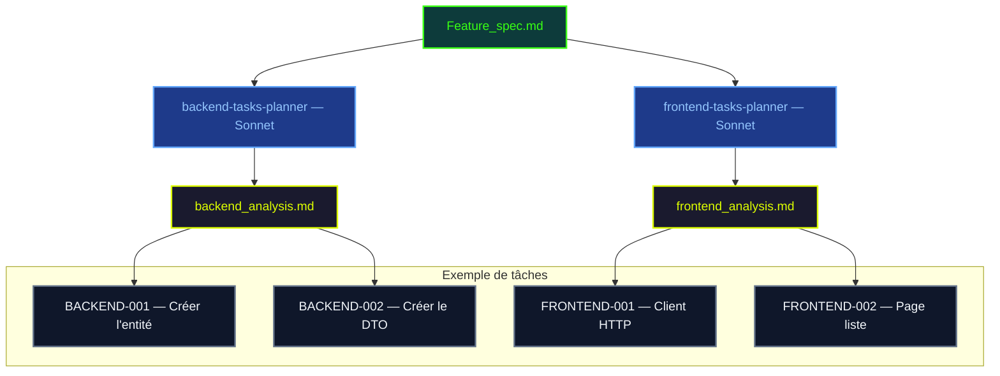

Chaque tâche contient :
- Un **ID unique** (BACKEND-001, FRONTEND-002...)
- Ses **dépendances** (quelles tâches doivent être terminées avant)
- Une **référence skill** (ex: `create-entity.md`) pour les conventions
- Des **critères d'acceptation** précis

<div class="validation-checkpoint">
<strong>Validation architecte</strong> — L'architecte approuve le découpage, vérifie les dépendances et l'ordre d'exécution.
</div>

---

### Étape 3 — Implémenter en TDD (Sonnet)

Les executors implémentent chaque tâche en **Test First** :

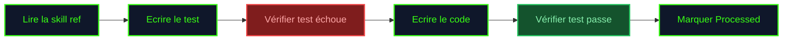

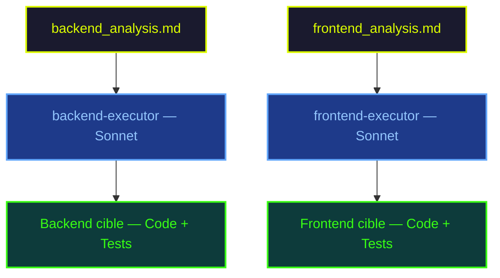

**Le secret : les skills comme garde-fous.** Les executors ne devinent pas les conventions — ils lisent `create-entity.md`, `create-dto.md`, `create-controller.md`. Cela garantit la cohérence d'une feature à l'autre.

---

### Étape 4 — Évaluer la conformité (Sonnet)

L'agent **score objectivement** le code contre la spec :

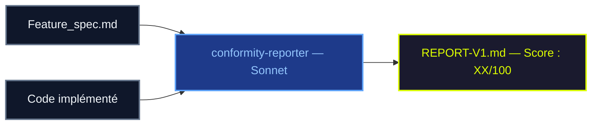

Système de déduction depuis un score initial de 100 :

| Sévérité | Déduction | Exemple concret |
|----------|-----------|-----------------|
| Critique | **-15 pts** | Endpoint manquant dans l'API |
| Haute | **-10 pts** | Pagination non implémentée |
| Moyenne | **-5 pts** | Tri par pertinence absent |
| Basse | **-2 pts** | Nommage non conforme |

Les rapports ne sont **jamais écrasés** — chaque évaluation produit une nouvelle version (V1, V2, V3).

---

### Étape 5 — Boucle qualité (LLM-as-Judge)

Le score détermine la suite :

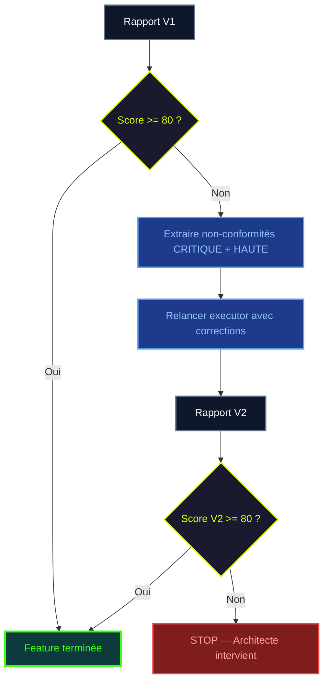

:::warning Maximum 2 itérations
Au-delà de 2 itérations, les corrections tendent à dégrader le code plutôt qu'à l'améliorer. L'architecte intervient pour arbitrer.
:::

<div class="validation-checkpoint">
<strong>Validation architecte</strong> — L'architecte supervise la boucle qualité et prend la main si le score reste insuffisant après 2 itérations.
</div>

---

## Phase 4 : Documentation continue

Contrairement à une approche classique où la documentation arrive en fin de projet, la documentation est ici **transversale** : elle peut être générée ou mise à jour à **chaque phase** pour disposer en permanence d'une documentation actualisée.

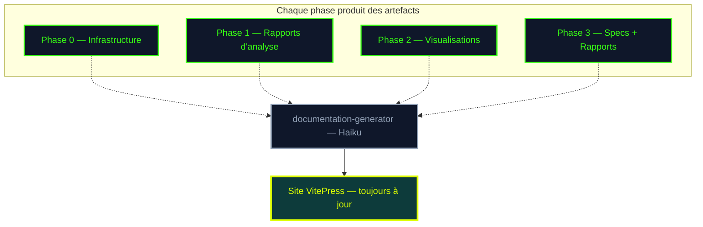

:::tip Documentation incrémentale
La commande `/modernization/generate-docs` peut être lancée à **n'importe quel moment** du pipeline. Chaque exécution intègre les derniers artefacts produits (rapports, specs, rapports de conformité). L'équipe dispose ainsi d'une documentation vivante qui reflète l'état réel de la migration.
:::

Haiku suffit car c'est du **Markdown structuré** avec un template clair — pas de raisonnement complexe.

<div class="validation-checkpoint">
<strong>Validation architecte</strong> — L'architecte relit la documentation générée et valide avant publication.
</div>

---

## Comment les agents communiquent

Les agents sont **isolés** — pas de mémoire partagée. Leur seul canal de communication : les **fichiers intermédiaires**.

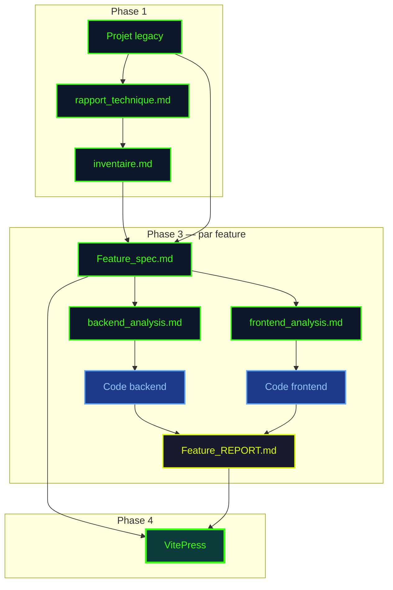

**Avantage clé** : chaque étape peut être **rejouée indépendamment**. Si l'implémentation échoue, on relance à l'étape 3 sans refaire l'analyse ni la planification :

```bash
/modernization/migrate-feature Search_Engine stage=3
```

---

## Répartition des modèles

Le principe : **utiliser le modèle le moins cher qui produit la qualité requise**.

<div class="model-distribution">
  <div class="model-bar">
    <div class="model-segment opus" style="flex: 2;">
      <span class="model-label">Opus</span>
      <span class="model-count">2</span>
    </div>
    <div class="model-segment sonnet" style="flex: 7;">
      <span class="model-label">Sonnet</span>
      <span class="model-count">7</span>
    </div>
    <div class="model-segment haiku" style="flex: 3;">
      <span class="model-label">Haiku</span>
      <span class="model-count">3</span>
    </div>
  </div>
  <div class="model-legend">
    <span class="legend-item opus">Opus — analyse profonde</span>
    <span class="legend-item sonnet">Sonnet — implémentation</span>
    <span class="legend-item haiku">Haiku — tâches légères</span>
  </div>
</div>

| Modèle | Quand | Agents |
|--------|-------|--------|
| **Opus** | Code brut non documenté, raisonnement complexe | technical-analyzer, feature-analyzer |
| **Sonnet** | Spec en entrée, patterns définis, TDD | planners, executors, conformity-reporter, refiner, functional-analyzer |
| **Haiku** | Templates clairs, vérifications simples | auditor, documentation-generator, health-check |

---

## Leçons apprises

| Ce qu'on a découvert | Ce qu'on a fait |
|---------------------|----------------|
| Opus est inutile quand l'agent lit un rapport, pas du code | `functional-analyzer` passé d'Opus à Sonnet |
| Les conventions dans les prompts d'agents sont ignorées | Extraites en fichiers `references/` dans les skills |
| Les reviews manuelles varient en qualité | Remplacées par une grille de déduction standardisée |
| L'affinement Haiku reformule sans enrichir | `refiner` passé de Haiku à Sonnet |
| Une rule seule peut être contournée | Double protection : rule + deny dans settings.json |
| Plus de 2 itérations de correction = dégradation | STOP obligatoire + intervention architecte |

---

## Ressources

- [Structure du projet .claude/](/examples/project-structure) — Organisation complète des fichiers
- [Pipeline de migration](/examples/pipeline) — Détail technique de chaque étape
- [Stratégie de modèles](/examples/model-strategy) — Choix Opus/Sonnet/Haiku par agent
