<script setup>
import { withBase } from 'vitepress'
</script>

# AI-Driven Modernisation : Legacy Transmutation

> Transformer n'importe quel projet legacy en architecture moderne — piloté par l'IA, **supervisé par un architecte/senior** à chaque phase, propulsé par l'écosystème Claude Code.

## Technologies cibles

Cette méthodologie est **agnostique de la technologie source**. Elle s'applique à toute migration legacy, quelle que soit la stack d'origine.

<div class="harness-note"><span class="hn-icon" aria-hidden="true"></span><div><strong class="hn-title">Harnais de modernisation</strong><p>Nous disposons de harnais de modernisation pour les technologies cibles listées ci-dessous.</p><p class="hn-sub">D'autres technologies peuvent également être prises en charge, sous réserve d'une étape préalable d'adaptation ou de développement du harnais approprié.</p></div></div>

| Cible | Stack type |
|-------|-----------|
| **React** | SPA web avec TypeScript, Vite, Tailwind |
| **React Native** | Application mobile cross-platform |
| **Symfony** | API REST backend PHP, PostgreSQL, JWT |
| **NestJS / Node.js** | API REST backend TypeScript, microservices |

:::info Exemple illustré
Dans cette page, l'exemple concret est une migration **PHP procédural → Symfony 7.4 + React 19**. Les principes et le pipeline s'appliquent identiquement aux autres cibles.
:::

---

## Les 3 principes fondateurs

| Principe | En pratique |
|----------|-----------|
| **Comprendre avant d'agir** | Ne jamais modifier du code sans l'avoir analysé en profondeur. L'analyse produit des artefacts écrits, pas des résumés verbaux. |
| **Le plan est un fichier** | Chaque étape produit un fichier Markdown qui sert de relais vers l'étape suivante. Pas de contexte partagé entre agents. |
| **L'implémentation est mécanique** | Toute la réflexion a lieu dans les phases d'analyse et de planification. Le code suit les specs et les conventions. |

---

## Garde-fous : garantir la conformité fonctionnelle

> **Promesse** : le système modernisé fait **exactement** ce que le legacy faisait.
> Six garde-fous forment une chaîne de traçabilité du code legacy au code moderne.

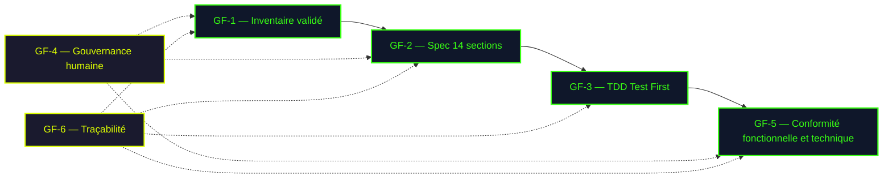
```mermaid
graph LR
    GF1["GF-1 — Inventaire validé"]
    GF2["GF-2 — Spec 14 sections"]
    GF3["GF-3 — TDD Test First"]
    GF4["GF-4 — Gouvernance humaine"]
    GF5["GF-5 — Conformité fonctionnelle et technique"]
    GF6["GF-6 — Traçabilité"]

    GF1 --> GF2 --> GF3 --> GF5
    GF4 -.-> GF1
    GF4 -.-> GF2
    GF4 -.-> GF5
    GF6 -.-> GF1
    GF6 -.-> GF2
    GF6 -.-> GF3
    GF6 -.-> GF5

    classDef seq fill:#0f172a,stroke:#39ff14,stroke-width:2px,color:#39ff14
    classDef transversal fill:#1a1a2e,stroke:#ddff00,stroke-width:2px,color:#ddff00

    class GF1,GF2,GF3,GF5 seq
    class GF4,GF6 transversal
```

| # | Garde-fou | Phase | Ce qu'il garantit |
|---|-----------|-------|-------------------|
| **GF-1** | **Validation humaine de l'inventaire : on implémente ce qu'on valide** | Phase 1 | Le client/PO confirme que 100% des features, rôles et flux métier sont capturés. Rien n'est implémenté sans avoir été validé. |
| **GF-2** | **Spec en 14 sections depuis le legacy** | Phase 3 | Chaque feature est spécifiée à partir du code legacy. Les scénarios utilisateur, règles métier, cas limites et considérations de tests reflètent le comportement existant, chaque règle avec sa source `fichier:ligne`. Tout changement de comportement est un écart, arbitré par l'humain avant la planification. Contenu de chaque section : [Les 14 sections de la spec](#sections-de-la-spec). |
| **GF-3** | **TDD — Test First** | Phase 3 | Chaque scénario de la spec devient un test **avant** le code. Le test échoue d'abord (red), le code le fait passer (green). Aucun comportement legacy n'est oublié — s'il est dans la spec, il a un test. |
| **GF-4** | **Gouvernance humaine** | Toutes | Architecte obligatoire à chaque phase. Client/PO valide le fonctionnel. STOP automatique si le score reste < 80 après la passe de correction (rapport V2) — l'humain reprend la main. |
| **GF-5** | **Conformité fonctionnelle et technique** | Phase 3 | Le conformity-reporter compare le code produit à la spec (dérivée du legacy). Score < 80 = corrections obligatoires. Rapports versionnés (V1, puis V2 après correction), jamais écrasés. |
| **GF-6** | **Traçabilité complète** | Toutes | Chaque artefact est un fichier versionné. On peut remonter de n'importe quel bout de code à la règle métier legacy qui l'a motivé. |

---

## Le pilotage humain

Les agents Claude automatisent l'exécution, mais les **décisions structurantes restent humaines**. Deux rôles complémentaires interviennent tout au long du processus :

<div class="role-cards">
  <div class="role-card architect">
    <h4>Architecte / Senior</h4>
    <ul>
      <li>Pilote techniquement et <strong>valide chaque phase</strong></li>
      <li>Définit les conventions et la structure cible</li>
      <li>Décide de l'ordre de migration</li>
      <li>Supervise la boucle qualité</li>
      <li>Présence <strong>obligatoire</strong> tout au long du processus</li>
    </ul>
  </div>
  <div class="role-card client">
    <h4>Client / PO / Métier</h4>
    <ul>
      <li>Garantit la <strong>fidélité fonctionnelle</strong></li>
      <li>Valide l'inventaire (features, rôles, flux)</li>
      <li>Priorise les features par valeur métier</li>
      <li>Valide les specs avant implémentation</li>
      <li>Présence <strong>fortement recommandée</strong> (phases 1, 2, 3)</li>
    </ul>
  </div>
</div>

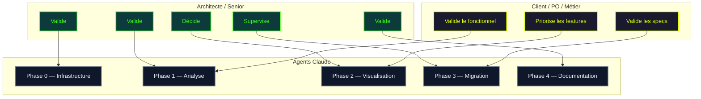
```mermaid
graph TB
    subgraph CLIENT["Client / PO / Métier"]
        C1["Valide le fonctionnel"]
        C2["Priorise les features"]
        C3["Valide les specs"]
    end

    subgraph ARCH["Architecte / Senior"]
        V0["Valide"]
        V1["Valide"]
        V2["Décide"]
        V3["Supervise"]
        V4["Valide"]
    end

    subgraph AGENTS["Agents Claude"]
        A0["Phase 0 — Infrastructure"]
        A1["Phase 1 — Analyse"]
        A2["Phase 2 — Visualisation"]
        A3["Phase 3 — Migration"]
        A4["Phase 4 — Documentation"]
    end

    V0 --> A0
    V1 --> A1
    V2 --> A2
    V3 --> A3
    V4 --> A4
    C1 --> A1
    C2 --> A2
    C3 --> A3

    classDef client fill:#1a1a2e,stroke:#ddff00,stroke-width:2px,color:#ddff00
    classDef arch fill:#0d3b3b,stroke:#39ff14,stroke-width:2px,color:#39ff14
    classDef agent fill:#0f172a,stroke:#64748b,stroke-width:2px,color:#f1f5f9

    class C1,C2,C3 client
    class V0,V1,V2,V3,V4 arch
    class A0,A1,A2,A3,A4 agent
```

| Phase | Architecte / Senior | Client / PO / Métier |
|-------|--------------------|--------------------|
| **Phase 0 — Infrastructure** | Définit les conventions, valide la structure `.claude/`, choisit les technologies cibles | — |
| **Phase 1 — Analyse** | Relit le rapport technique, corrige les erreurs d'interprétation | **Valide l'inventaire** : signale les features, rôles ou règles oubliés |
| **Phase 2 — Visualisation** | Décide de l'**ordre de migration** en fonction des dépendances techniques | **Priorise** selon la valeur métier, avec l'architecte |
| **Phase 3 — Migration** | Arbitre les écarts et les tâches bloquées, relit le plan, reprend la main si V2 < 80 | **Valide les specs** : règles, scénarios, cas limites, écarts au legacy |
| **Phase 4 — Documentation** | Relit et valide la documentation technique | Valide la documentation fonctionnelle |

:::warning Présence obligatoire
La présence d'un architecte ou senior est **obligatoire** tout au long du processus. La participation du client / PO est **fortement recommandée** aux phases 1, 2 et 3 — c'est le moment de détecter les oublis et d'ajuster avant que le code ne soit écrit. Les agents sont des outils d'exécution, pas des décideurs. L'humain garde le contrôle sur :
- Les choix d'architecture et les priorités de migration
- La validation fonctionnelle (complétude des features, règles métier)
- Les arbitrages qualité/délai/périmètre
:::

### Le wiki, tableau de bord du pilotage {#wiki-pilotage}

Le wiki VitePress généré par `/mod-generate-docs` (dossier `WIKI_TARGET`) est le point de suivi commun de l'équipe : chacun y lit l'état de la migration sans ouvrir les fichiers de `output/`.

**Ce qu'on y suit :**
- **L'avancement par feature** : tâches faites, à faire et bloquées (`Processed`, `Unprocessed`, `Blocked` des analyses backend et frontend), état de chaque feature (planifiée, en cours, bloquée, terminée…), features prêtes à migrer, écarts au legacy encore à arbitrer.
- **Les scores de conformité** V1 et V2 de chaque feature évaluée.
- **La cartographie** : graphe de dépendances, vagues de migration (ordre déduit des dépendances) et arbre fonctionnel.
- **La timeline des lots** de chaque feature et le **journal** de la modernisation (une entrée par événement : spec, planification, lot, conformité).
- **L'inventaire de la configuration** `.claude/` (agents, skills, rules, permissions) sur la page Claude Code Harness.

**Qui l'utilise :**

| Rôle | Ce qu'il y cherche |
|------|--------------------|
| **Chef de projet** | L'avancement global et par feature, les tâches bloquées qui attendent une décision |
| **Architecte** | Les specs et les analyses API / Frontend, relues avant l'implémentation (la « validation architecte » de l'étape 2, pratique d'équipe), puis les scores de conformité |
| **Métier** | Les règles métier des specs et les écarts au legacy arbitrés (section 13 de chaque spec) |

**Pourquoi s'y fier**
- **Aucun chiffre saisi à la main** : indicateurs, timeline et cartographie sont calculés à partir des fichiers du projet (inventaire, specs, statut des tâches, rapports de conformité).
- **Toujours à jour** : le pipeline met le wiki à jour à chaque étape clé, dans le même commit que le code.
- **Résultat** : le tableau de bord reflète exactement le dépôt.

<CasUsageCards>
  <CasUsageCard page="modernisation/index.html#modernisation-—-vue-d-ensemble" title="Tableau de bord" desc="Avancement par feature : tâches faites, à faire, bloquées" />
  <CasUsageCard page="modernisation/index.html#resultats-verifies" title="Résultats vérifiés" desc="Tests et scores de conformité, mesurés" />
  <CasUsageCard page="mapping/index.html#cartographie-de-la-migration" title="Cartographie" desc="Graphe de dépendances, vagues de migration, arbre fonctionnel" />
  <CasUsageCard page="modernisation/regions.html#timeline" title="Timeline du module Régions" desc="Chaque lot de 3 tâches, testé puis commité" />
</CasUsageCards>

---

## Vue d'ensemble : 5 phases

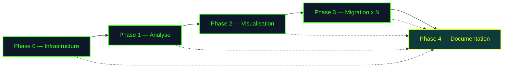
```mermaid
graph LR
    P0["Phase 0 — Infrastructure"]
    P1["Phase 1 — Analyse"]
    P2["Phase 2 — Visualisation"]
    P3["Phase 3 — Migration x N"]
    P4["Phase 4 — Documentation"]

    P0 --> P1 --> P2 --> P3 --> P4

    P0 -.-> P4
    P1 -.-> P4
    P2 -.-> P4
    P3 -.-> P4

    classDef phase fill:#0f172a,stroke:#39ff14,stroke-width:2px,color:#39ff14
    classDef doc fill:#0d3b3b,stroke:#ddff00,stroke-width:2px,color:#ddff00

    class P0,P1,P2,P3 phase
    class P4 doc
```

---

## Phase 0 : Construire l'infrastructure

Avant de toucher au code, on construit l'**écosystème déclaratif** qui pilotera tous les agents.

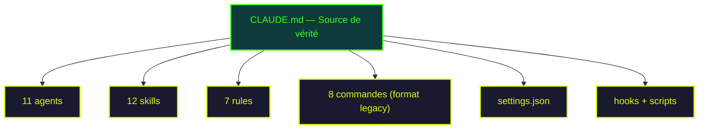
```mermaid
graph TB
    CM["CLAUDE.md — Source de vérité"]

    CM --> AG["11 agents"]
    CM --> SK["12 skills"]
    CM --> RU["7 rules"]
    CM --> CO["8 commandes (format legacy)"]
    CM --> SE["settings.json"]
    CM --> HK["hooks + scripts"]

    classDef source fill:#0d3b3b,stroke:#39ff14,stroke-width:2px,color:#39ff14
    classDef item fill:#1a1a2e,stroke:#ddff00,stroke-width:2px,color:#ddff00
    class CM source
    class AG,SK,RU,CO,SE,HK item
```

:::info Ce qu'on pose comme fondations
| Brique | Rôle |
|---|---|
| **CLAUDE.md** | Source unique des chemins (alias) : un seul endroit à modifier. `health-check` vérifie que les rares chemins écrits en dur restent alignés. |
| **Skills** | Portent les conventions (backend, frontend, tests) ; chaque agent reçoit celles dont il a besoin. |
| **Commandes** | Les gestes techniques du quotidien : tests, lint, commit (`/dev:…`), reviews (`/review:…`). |
| **Script d'installation** | `/dev:install-stack` installe les stacks cibles ; il n'écrase rien sans votre confirmation. |

**Trois couches protègent le projet :**
- **Rule** : consigne au modèle (« le legacy est en lecture seule ») ; elle peut ne pas être suivie, d'où les deux couches suivantes.
- **Permissions** (`settings.json`) : liste blanche des commandes ; confirmation pour les actions destructrices et les commits ; legacy interdit en écriture, secrets (`.env`) ni lus ni modifiés.
- **Hook** : bloque toute suppression récursive, testé par une suite de cas.
:::

<div class="validation-checkpoint">
<strong>Validation</strong>
<div class="role-line"><span class="role-badge architecte">Architecte</span><span>Valide les conventions, la configuration et les permissions.</span></div>
</div>

<CasUsageCards>
  <CasUsageCard page="modernisation/claude-harness.html#architecture" title="Structure .claude/" desc="Arborescence de la configuration du projet" />
  <CasUsageCard page="modernisation/claude-harness.html#agents" title="Agents" desc="Rôle, modèle et maxTurns de chaque agent" />
  <CasUsageCard page="modernisation/claude-harness.html#skills" title="Skills" desc="Launchers et conventions préchargées" />
  <CasUsageCard page="modernisation/claude-harness.html#permissions-settings-json" title="Permissions" desc="Liste blanche, confirmations, interdictions" />
</CasUsageCards>

---

## Phase 1 : Comprendre le legacy

On lance une seule commande. Trois agents se relaient :


```mermaid
graph LR
    CMD["/mod-analyze-legacy"]
    T["Analyse technique — Opus"]
    F["Inventaire fonctionnel — Sonnet"]
    A["Audit — Haiku"]
    OUT["Legacy compris"]

    CMD --> T
    T -->|"7 fichiers output/technique/"| F
    F -->|"0-index.md + 0-features-tree.json"| A
    A -->|"0-index.md enrichi"| OUT

    classDef cmd fill:#0d3b3b,stroke:#39ff14,stroke-width:2px,color:#39ff14
    classDef opus fill:#1a1a2e,stroke:#ddff00,stroke-width:2px,color:#ddff00
    classDef sonnet fill:#1e3a8a,stroke:#60a5fa,stroke-width:2px,color:#93c5fd
    classDef haiku fill:#0f172a,stroke:#64748b,stroke-width:2px,color:#94a3b8
    classDef done fill:#0d3b3b,stroke:#39ff14,stroke-width:3px,color:#39ff14

    class CMD cmd
    class T opus
    class F sonnet
    class A haiku
    class OUT done
```

| Agent | Modèle | Rôle | Pourquoi ce modèle |
|-------|--------|------|-------------------|
| legacy-technical-analyzer | **Opus** | Reverse engineering du code brut | Code non documenté, architecture implicite |
| legacy-functional-analyzer | **Sonnet** | Inventaire features/rôles/flux | Lit le rapport technique, pas du code brut |
| legacy-functional-analyzer-auditor | **Haiku** | Vérifie la complétude | Simple comparaison, pas de raisonnement |

**Artefacts produits :**

```
output/technique/          (SOURCE_TECHNICAL_DIR — legacy-technical-analyzer)
├── 00-index.md            → Table des matières
├── 01-overview.md         → Vue d'ensemble, architecture
├── 02-data-flow.md        → Flux et logique
├── 03-database.md         → Base de données
├── 04-dependencies.md     → Dépendances
├── 05-deployment.md       → Déploiement
└── 06-audit.md            → Audit qualité et recommandations

output/features/           (FEATURE_SPECS_DIR — legacy-functional-analyzer)
├── 0-index.md             → Features, rôles, flux métier (enrichi par l'audit)
└── 0-features-tree.json   → Arbre fonctionnel parent-enfant
```

**Après l'audit, la commande enchaîne :**
- **Specs détaillées** (optionnel) : un agent Opus par feature, en parallèle.
- **Visualisations** : cartographie des features et de leurs dépendances.
- **Synchronisation du wiki.**

**Reprise** : si la commande s'interrompt, on la relance à partir de l'étape voulue (par exemple `/mod-analyze-legacy features`).

<div class="validation-checkpoint with-client">
<strong>Validation</strong>
<div class="role-line"><span class="role-badge architecte">Architecte</span><span>Corrige le rapport technique.</span></div>
<div class="role-line"><span class="role-badge client">Client / PO</span><span>Valide l'inventaire : features, rôles et règles oubliés. Corriger ici coûte bien moins qu'après l'implémentation.</span></div>
</div>

<CasUsageCards>
  <CasUsageCard page="docs/analyses/overview.html#_2-architecture-de-haut-niveau" title="Architecture du legacy" desc="Vue de haut niveau du code existant" />
  <CasUsageCard page="docs/analyses/database.html#_2-modele-de-donnees-erd" title="Modèle de données" desc="Schéma ERD reconstitué depuis le legacy" />
  <CasUsageCard page="docs/analyses/data-flow.html#_1-flux-applicatif-principal" title="Flux applicatif" desc="Parcours principal d'une requête" />
  <CasUsageCard page="docs/analyses/audit.html#_6-4-plan-d-action-priorise" title="Audit" desc="Plan d'action priorisé" />
  <CasUsageCard page="docs/features/index.html#inventaire-des-features" title="Inventaire des features" desc="Features, rôles et flux identifiés" />
</CasUsageCards>

---

## Phase 2 : Visualiser pour décider

L'inventaire est transformé en **visualisations interactives** (HTML standalone avec ECharts). La skill est lancée automatiquement à l'étape 5 de `/mod-analyze-legacy` et peut être relancée seule après un enrichissement de l'inventaire ou de l'arbre (par exemple quand l'affinement d'une spec ajoute des sous-fonctionnalités) :

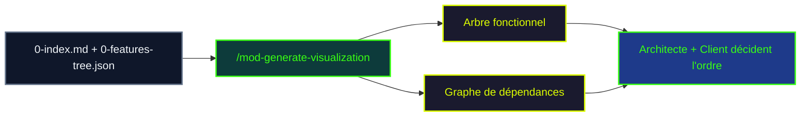
```mermaid
graph LR
    INV["0-index.md + 0-features-tree.json"]
    VIZ["/mod-generate-visualization"]
    T["Arbre fonctionnel"]
    G["Graphe de dépendances"]
    D["Architecte + Client décident l'ordre"]

    INV --> VIZ
    VIZ --> T
    VIZ --> G
    T --> D
    G --> D

    classDef input fill:#0f172a,stroke:#64748b,stroke-width:2px,color:#f1f5f9
    classDef cmd fill:#0d3b3b,stroke:#39ff14,stroke-width:2px,color:#39ff14
    classDef output fill:#1a1a2e,stroke:#ddff00,stroke-width:2px,color:#ddff00
    classDef decision fill:#1e3a8a,stroke:#39ff14,stroke-width:2px,color:#39ff14

    class INV input
    class VIZ cmd
    class T,G output
    class D decision
```

<div class="validation-checkpoint with-client">
<strong>Décision</strong>
<div class="role-line"><span class="role-badge architecte">Architecte</span><span>Repère les features sans dépendances, à migrer en premier.</span></div>
<div class="role-line"><span class="role-badge client">Client / PO</span><span>Priorise selon la valeur métier. Ensemble, ils fixent l'ordre de migration.</span></div>
</div>

<CasUsageCards>
  <CasUsageCard page="mapping/index.html#cartographie-de-la-migration" title="Cartographie" desc="Graphe de dépendances, vagues de migration, arbre fonctionnel" />
</CasUsageCards>

---

## Phase 3 : Migrer chaque feature

C'est le coeur du pipeline. Pour chaque feature, on lance :

```bash
/mod-migrate-feature Search_Engine
```

**Le nom de la feature** fait le lien entre tous ses fichiers (spec, analyses, rapport de conformité) et tous les agents. Il vient de l'inventaire (`User Authentication` donne `User_Authentication`), et vous pouvez le taper librement : `/mod-migrate-feature user-authentication` suffit. S'il est introuvable ou ambigu, le launcher s'arrête et vous demande.

### Vue d'ensemble : 5 étapes coeur, encadrées par les étapes 0 et 6


```mermaid
graph LR
    Z{"Etape 0 — Stacks cibles présents ?"}
    INST["/dev:install-stack"]
    S["Etape 1 — Spécifier — Opus"]
    P["Etape 2 — Planifier — Sonnet"]
    I["Etape 3 — Implémenter — Sonnet"]
    C["Etape 4 — Evaluer — Sonnet"]
    Q{"Etape 5 — Score >= 80 ?"}
    FX["1 passe de correction + rapport V2"]
    Q2{"Score V2 >= 80 ?"}
    STOP["STOP — architecte"]
    OK["Feature migrée"]
    W["Etape 6 — Sync wiki (/mod-generate-docs)"]

    Z -->|Oui| S
    Z -->|Non| INST
    S --> P --> I --> C --> Q
    Q -->|Oui| OK
    Q -->|Non| FX
    FX --> Q2
    Q2 -->|Oui| OK
    Q2 -->|Non| STOP
    OK --> W

    classDef opus fill:#1a1a2e,stroke:#ddff00,stroke-width:2px,color:#ddff00
    classDef sonnet fill:#1e3a8a,stroke:#60a5fa,stroke-width:2px,color:#93c5fd
    classDef check fill:#0f172a,stroke:#39ff14,stroke-width:2px,color:#39ff14
    classDef done fill:#0d3b3b,stroke:#39ff14,stroke-width:3px,color:#39ff14

    classDef cmd fill:#0d3b3b,stroke:#39ff14,stroke-width:2px,color:#39ff14
    classDef stop fill:#7f1d1d,stroke:#ef4444,stroke-width:2px,color:#fca5a5

    class S opus
    class P,I,C,FX sonnet
    class Z,Q,Q2 check
    class OK done
    class INST,W cmd
    class STOP stop
```

**Avant et après les 5 étapes :**
- **Étape 0** : le pipeline vérifie que les stacks cibles sont installées ; sinon il s'arrête et propose `/dev:install-stack`.
- **Étape 6** : il synchronise le wiki. Le wiki est aussi mis à jour en cours de route, à chaque étape clé : voir [Le wiki, tableau de bord du pilotage](#wiki-pilotage).

<CasUsageCards>
  <CasUsageCard page="modernisation/index.html#modernisation-—-vue-d-ensemble" title="Tableau de bord" desc="Avancement par feature : tâches faites, à faire, bloquées" />
  <CasUsageCard page="modernisation/index.html#resultats-verifies" title="Résultats vérifiés" desc="Tests et scores de conformité, mesurés" />
</CasUsageCards>

---

### Étape 1 — Spécifier (Opus)

L'agent Opus produit une **spec en 14 sections** à partir du code legacy et de l'inventaire fonctionnel. Son prompt ne contient que `Feature : <feature>`, jamais une autre spec : l'agent part du seul code legacy.

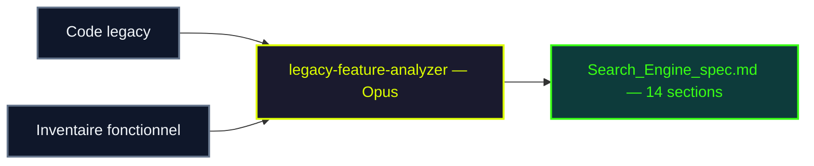
```mermaid
graph LR
    IN1["Code legacy"]
    IN2["Inventaire fonctionnel"]
    FA["legacy-feature-analyzer — Opus"]
    SPEC["Search_Engine_spec.md — 14 sections"]

    IN1 --> FA
    IN2 --> FA
    FA --> SPEC

    classDef input fill:#0f172a,stroke:#64748b,stroke-width:2px,color:#f1f5f9
    classDef opus fill:#1a1a2e,stroke:#ddff00,stroke-width:2px,color:#ddff00
    classDef output fill:#0d3b3b,stroke:#39ff14,stroke-width:2px,color:#39ff14

    class IN1,IN2 input
    class FA opus
    class SPEC output
```

#### Les 14 sections de la spec {#sections-de-la-spec}

Les 14 sections (titres `## N. Titre` du gabarit de `legacy-feature-analyzer`) couvrent **tous les angles** d'une feature. La spec du module Régions du cas d'usage sert d'exemple pour chacune :

| N° | Section | Ce qu'elle contient | Exemple réel |
|----|---------|---------------------|--------------|
| 1 | Vue d'Ensemble | Objectif et valeur métier, périmètre, rôles utilisateurs, hypothèses d'analyse | <CasUsage page="docs/features/regions.html#sec-1">module Régions</CasUsage> |
| 2 | Référence à l'Implémentation Source | Stack legacy, fichiers source, dépendances internes et externes, modèles de données | <CasUsage page="docs/features/regions.html#sec-2">module Régions</CasUsage> |
| 3 | Scénarios Utilisateur | Par scénario : acteur, préconditions, flux principal, flux alternatifs, postconditions | <CasUsage page="docs/features/regions.html#sec-3">module Régions</CasUsage> |
| 4 | Points d'Interaction | Composants UI (champs, boutons, comportements) et endpoints API, contrat transposé du legacy (T-01, T-02, T-05) | <CasUsage page="docs/features/regions.html#sec-4">module Régions</CasUsage> |
| 5 | Règles Métier | Par règle : description, condition, application, gestion des violations, exemple | <CasUsage page="docs/features/regions.html#sec-5">module Régions</CasUsage> |
| 6 | Règles de Validation des Données | Contraintes et messages d'erreur par champ, unicité, intégrité référentielle | <CasUsage page="docs/features/regions.html#sec-6">module Régions</CasUsage> |
| 7 | Gestion de l'État | État applicatif, transitions d'état, état persistant (quoi, où, quand) | <CasUsage page="docs/features/regions.html#sec-7">module Régions</CasUsage> |
| 8 | Contrôle d'Accès & Autorisation | Permissions par action, règles de visibilité, accès aux données (lecture, création, mise à jour, suppression) | <CasUsage page="docs/features/regions.html#sec-8">module Régions</CasUsage> |
| 9 | Gestion des Erreurs | Erreurs visibles (message, cause, récupération) et erreurs système | <CasUsage page="docs/features/regions.html#sec-9">module Régions</CasUsage> |
| 10 | Cas Limites & Scénarios Spéciaux | Par cas : déclencheur, comportement attendu, implémentation legacy actuelle | <CasUsage page="docs/features/regions.html#sec-10">module Régions</CasUsage> |
| 11 | Points d'Intégration | Intégrations internes (autres features) et externes (services) | <CasUsage page="docs/features/regions.html#sec-11">module Régions</CasUsage> |
| 12 | Considérations pour les Tests | Scénarios critiques, conditions limites, cas négatifs, données de test | <CasUsage page="docs/features/regions.html#sec-12">module Régions</CasUsage> |
| 13 | Notes de Migration | Transpositions T-01 à T-07 appliquées, **tableau « Écarts au Legacy »** (colonne `Décision`, arbitrée par l'humain), défis techniques, patterns propres au legacy | <CasUsage page="docs/features/regions.html#sec-13">module Régions</CasUsage> |
| 14 | Annexe | Glossaire, features liées, sous-fonctionnalités identifiées (versées dans `0-features-tree.json`), références au code source | <CasUsage page="docs/features/regions.html#sec-14">module Régions</CasUsage> |

Une section sans objet n'est pas supprimée : elle contient « Non applicable » et sa justification. Le launcher vérifie que les 14 sections sont présentes, dans l'ordre.

**Fidélité au legacy**
- **Sections 1 à 12** : uniquement le comportement du legacy, chaque règle avec sa source dans le code.
- **Admis d'office** : les changements techniques imposés par la nouvelle stack, par exemple MySQL qui devient PostgreSQL, ou les pages PHP qui deviennent une API et une application React. Ils ne changent rien au métier.
- **Tout autre changement est un écart** (règle ajoutée, bug corrigé…), consigné en section 13. Par défaut, on reproduit le legacy.

<p class="stop-note"><span><strong>Le pipeline s'arrête</strong> tant que chaque écart n'a pas été arbitré par l'humain : reproduire le legacy, ou corriger.</span></p>

<div class="validation-checkpoint with-client">
<strong>Validation</strong>
<div class="role-line"><span class="role-badge architecte">Architecte</span><span>Arbitre chaque écart au legacy, avec le client.</span></div>
<div class="role-line"><span class="role-badge client">Client / PO</span><span>Valide règles métier, scénarios et cas limites : dernière occasion avant la planification.</span></div>
</div>

<CasUsageCards>
  <CasUsageCard page="docs/features/regions.html#sec-1" title="Spec du module Régions" desc="14 sections tirées du code legacy" />
  <CasUsageCard page="docs/features/regions.html#sec-13" title="Écarts arbitrés" desc="Section 13 : écarts au legacy et décisions" />
</CasUsageCards>

---

### Étape 2 — Planifier (Sonnet)

Deux planners découpent la spec en **tâches numérotées avec dépendances**. Le backend passe en premier et définit le contrat de l'API ; le frontend s'appuie sur ce contrat :

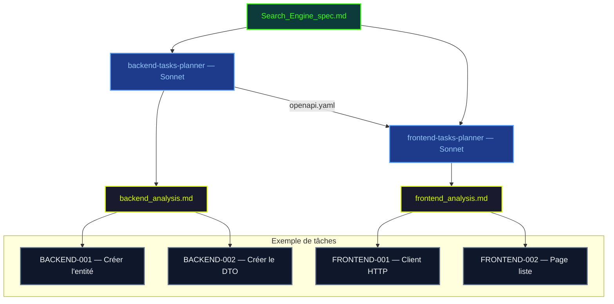
```mermaid
graph TB
    SPEC["Search_Engine_spec.md"]
    BP["backend-tasks-planner — Sonnet"]
    FP["frontend-tasks-planner — Sonnet"]
    BA["backend_analysis.md"]
    FA["frontend_analysis.md"]

    SPEC --> BP
    SPEC --> FP
    BP --> BA
    BP -->|openapi.yaml| FP
    FP --> FA

    subgraph TASKS["Exemple de tâches"]
        T1["BACKEND-001 — Créer l'entité"]
        T2["BACKEND-002 — Créer le DTO"]
        T3["FRONTEND-001 — Client HTTP"]
        T4["FRONTEND-002 — Page liste"]
    end

    BA --> T1
    BA --> T2
    FA --> T3
    FA --> T4

    classDef input fill:#0d3b3b,stroke:#39ff14,stroke-width:2px,color:#39ff14
    classDef sonnet fill:#1e3a8a,stroke:#60a5fa,stroke-width:2px,color:#93c5fd
    classDef output fill:#1a1a2e,stroke:#ddff00,stroke-width:2px,color:#ddff00
    classDef task fill:#0f172a,stroke:#64748b,stroke-width:2px,color:#f1f5f9

    class SPEC input
    class BP,FP sonnet
    class BA,FA output
    class T1,T2,T3,T4 task
```

Chaque tâche contient :
- Un **ID unique** et un titre (`#### BACKEND-001 : <titre>`)
- Ses **dépendances** (`Dépend de` : quelles tâches doivent être terminées avant)
- Un **Status** (`Unprocessed`, puis `Processed` ou `Blocked`)
- Une **référence source** legacy (fichier, lignes)
- Des **critères d'acceptation** précis

Les conventions ne sont pas recopiées tâche par tâche : planners et executors les reçoivent par les skills préchargées (champ `skills:` de leur frontmatter).

<div class="validation-checkpoint">
<strong>Validation recommandée (le pipeline ne s'arrête pas)</strong>
<div class="role-line"><span class="role-badge architecte">Architecte</span><span>Relit le plan de tâches avant l'implémentation, et interrompt si besoin.</span></div>
</div>

<CasUsageCards>
  <CasUsageCard page="modernisation/api/regions.html#liste-des-taches-backend" title="Tâches backend du module Régions" desc="Tâches numérotées, dépendances, statut" />
  <CasUsageCard page="modernisation/api/regions.html#specification-openapi" title="Contrat OpenAPI" desc="Endpoints planifiés, base du frontend" />
  <CasUsageCard page="modernisation/frontend/regions.html#liste-des-taches-frontend" title="Tâches frontend du module Régions" desc="Tâches numérotées, dépendances, statut" />
</CasUsageCards>

---

### Étape 3 — Implémenter en TDD (Sonnet)

Les executors implémentent chaque tâche en **Test First** :

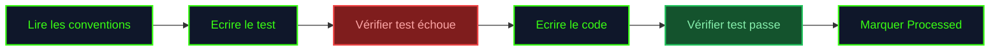
```mermaid
graph LR
    R["Lire les conventions"]
    T["Ecrire le test"]
    F["Vérifier test échoue"]
    I["Ecrire le code"]
    P["Vérifier test passe"]
    M["Marquer Processed"]

    R --> T --> F --> I --> P --> M

    classDef step fill:#0f172a,stroke:#39ff14,stroke-width:2px,color:#39ff14
    classDef fail fill:#7f1d1d,stroke:#ef4444,stroke-width:2px,color:#fca5a5
    classDef pass fill:#14532d,stroke:#22c55e,stroke-width:2px,color:#86efac

    class R,T,I,M step
    class F fail
    class P pass
```

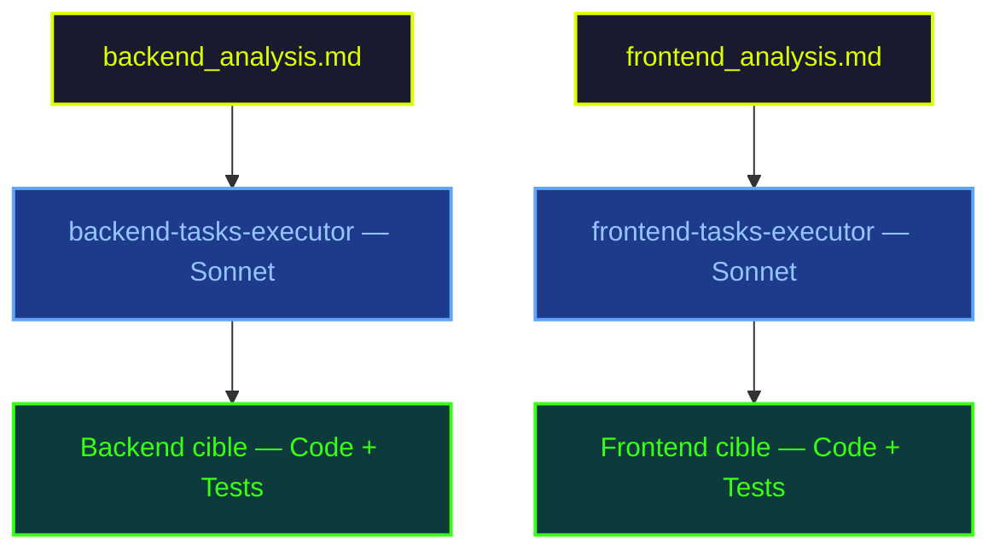
```mermaid
graph TB
    BA["backend_analysis.md"]
    FA["frontend_analysis.md"]
    BE["backend-tasks-executor — Sonnet"]
    FE["frontend-tasks-executor — Sonnet"]
    SYM["Backend cible — Code + Tests"]
    FRONT["Frontend cible — Code + Tests"]

    BA --> BE
    FA --> FE
    BE --> SYM
    FE --> FRONT

    classDef input fill:#1a1a2e,stroke:#ddff00,stroke-width:2px,color:#ddff00
    classDef sonnet fill:#1e3a8a,stroke:#60a5fa,stroke-width:2px,color:#93c5fd
    classDef output fill:#0d3b3b,stroke:#39ff14,stroke-width:2px,color:#39ff14

    class BA,FA input
    class BE,FE sonnet
    class SYM,FRONT output
```

**Les skills, garde-fous des conventions** : les agents ne devinent pas les règles de code. Ils reçoivent les conventions du projet (backend ou frontend), avec des exemples à suivre. Chaque feature est donc écrite de la même façon.

**Comment l'implémentation avance**
- **Par petits lots** : les tâches sont traitées 3 par 3.
- **Chaque lot est testé**, puis commité avec votre accord.
- **À la fin**, la documentation de la feature est générée.

<p class="stop-note"><span><strong>Le pipeline s'arrête</strong> si une tâche est bloquée : il vous montre le problème et la solution proposée, et vous décidez.</span></p>

<p class="stop-note"><span><strong>Le pipeline s'arrête</strong> si les tests échouent : on corrige, puis on relance.</span></p>

**Reprise** : en cas d'interruption, on relance la même commande ; le dernier lot est re-testé avant de continuer.

::: info Chez nous
Les agents ne commitent jamais eux-mêmes : le pipeline commite chaque lot vérifié, avec votre accord, et met le wiki à jour dans le même commit.
:::

<CasUsageCards>
  <CasUsageCard page="modernisation/regions.html#timeline" title="Timeline du module Régions" desc="Chaque lot de 3 tâches, testé puis commité" />
  <CasUsageCard page="modernisation/changelog.html#journal-de-modernisation" title="Journal" desc="Les étapes de la migration, dans l'ordre" />
</CasUsageCards>

---

### Étape 4 — Évaluer la conformité (Sonnet) {#etape-4}

L'agent **score objectivement** le code contre la spec :

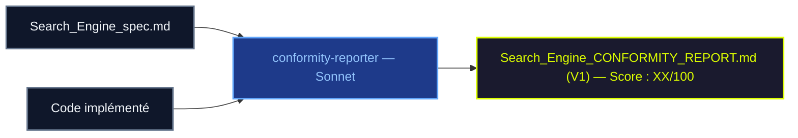
```mermaid
graph LR
    SPEC["Search_Engine_spec.md"]
    CODE["Code implémenté"]
    CR["conformity-reporter — Sonnet"]
    REPORT["Search_Engine_CONFORMITY_REPORT.md (V1) — Score : XX/100"]

    SPEC --> CR
    CODE --> CR
    CR --> REPORT

    classDef input fill:#0f172a,stroke:#64748b,stroke-width:2px,color:#f1f5f9
    classDef sonnet fill:#1e3a8a,stroke:#60a5fa,stroke-width:2px,color:#93c5fd
    classDef output fill:#1a1a2e,stroke:#ddff00,stroke-width:2px,color:#ddff00

    class SPEC,CODE input
    class CR sonnet
    class REPORT output
```

**Comment le score est calculé**

Chaque section du rapport part de **100 points**. On retire des points pour chaque problème trouvé, selon sa gravité :

| Gravité | Points retirés | Exemple |
|---|---|---|
| Critique | −15 | Endpoint manquant dans l'API |
| Élevée | −10 | Pagination non implémentée |
| Moyenne | −5 (25 au plus par section) | Tri par pertinence absent |
| Basse | −2 (10 au plus par section) | Nommage non conforme |

**Le score global** combine 4 critères :
- **conventions du projet** : 30 % ;
- **cohérence avec le code existant** : 25 % ;
- **respect de la spec** : 25 % ;
- **alignement avec les analyses** : 20 %.

**Les rapports ne sont jamais écrasés** : V1 après l'implémentation, V2 après la passe de correction. Le pipeline s'arrête à V2.

<CasUsageCards>
  <CasUsageCard page="modernisation/conformity-categories.html#score-global" title="Score de conformité" desc="Rapport du module Catégories : score global" />
  <CasUsageCard page="modernisation/conformity-categories.html#tableau-de-bord" title="Scores par section" desc="Détail du barème du rapport" />
</CasUsageCards>

---

### Étape 5 — Boucle qualité (LLM-as-Judge) {#etape-5}

Le score détermine la suite :

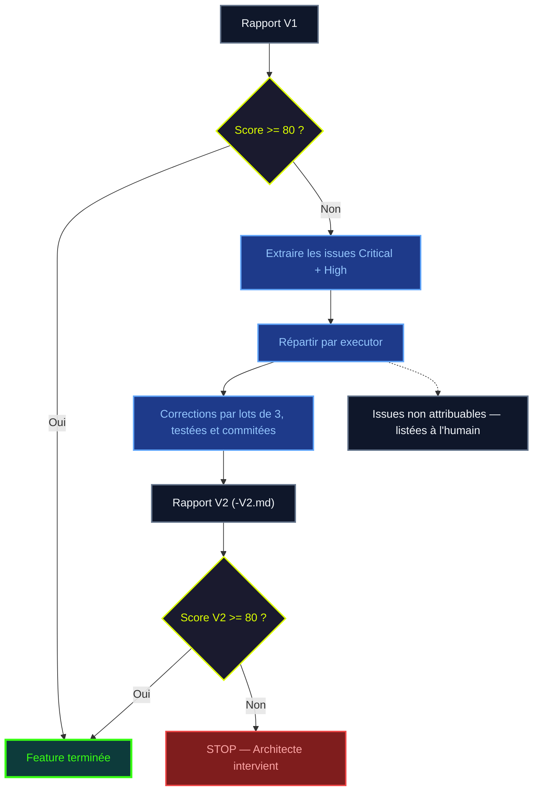
```mermaid
graph TB
    R["Rapport V1"]
    CHECK{"Score >= 80 ?"}
    OK["Feature terminée"]
    FIX["Extraire les issues Critical + High"]
    SPLIT["Répartir par executor"]
    HUM["Issues non attribuables — listées à l'humain"]
    EXEC["Corrections par lots de 3, testées et commitées"]
    R2["Rapport V2 (-V2.md)"]
    CHECK2{"Score V2 >= 80 ?"}
    STOP["STOP — Architecte intervient"]

    R --> CHECK
    CHECK -->|Oui| OK
    CHECK -->|Non| FIX
    FIX --> SPLIT
    SPLIT --> EXEC
    SPLIT -.-> HUM
    EXEC --> R2
    R2 --> CHECK2
    CHECK2 -->|Oui| OK
    CHECK2 -->|Non| STOP

    classDef input fill:#0f172a,stroke:#64748b,stroke-width:2px,color:#f1f5f9
    classDef check fill:#1a1a2e,stroke:#ddff00,stroke-width:2px,color:#ddff00
    classDef ok fill:#0d3b3b,stroke:#39ff14,stroke-width:3px,color:#39ff14
    classDef fix fill:#1e3a8a,stroke:#60a5fa,stroke-width:2px,color:#93c5fd
    classDef stop fill:#7f1d1d,stroke:#ef4444,stroke-width:2px,color:#fca5a5

    class R,R2,HUM input
    class CHECK,CHECK2 check
    class OK ok
    class FIX,SPLIT,EXEC fix
    class STOP stop
```

**Comment se passe la correction**
- **Les problèmes graves** (critiques et élevés) du rapport V1 sont confiés aux agents backend ou frontend selon leur emplacement.
- **Comme à l'implémentation** : par petits lots, chaque lot testé puis commité.
- **Ce qu'aucun agent ne peut corriger** (spec, analyses) vous est présenté.
- **Une fois tout corrigé**, le rapport V2 mesure le résultat.

:::warning Une seule passe de correction
Au-delà d'une passe, les corrections tendent à dégrader le code plutôt qu'à l'améliorer : si le V2 reste sous 80/100, le pipeline s'arrête et l'architecte arbitre.
:::

<div class="validation-checkpoint">
<strong>Validation</strong>
<div class="role-line"><span class="role-badge architecte">Architecte</span><span>Reprend la main si le score V2 reste sous 80/100.</span></div>
</div>

<CasUsageCards>
  <CasUsageCard page="modernisation/conformity-categories.html#decision" title="Décision" desc="Verdict du rapport et suite à donner" />
  <CasUsageCard page="modernisation/conformity-categories.html#suivi-v1-→-v2-section-11-4-anticipee" title="Suivi V1 → V2" desc="Ce que la passe de correction a changé" />
</CasUsageCards>

---

## Phase 4 : Documentation continue

Contrairement à une approche classique où la documentation arrive en fin de projet, la documentation est ici **transversale** : elle peut être générée ou mise à jour à **chaque phase** pour disposer en permanence d'une documentation actualisée.

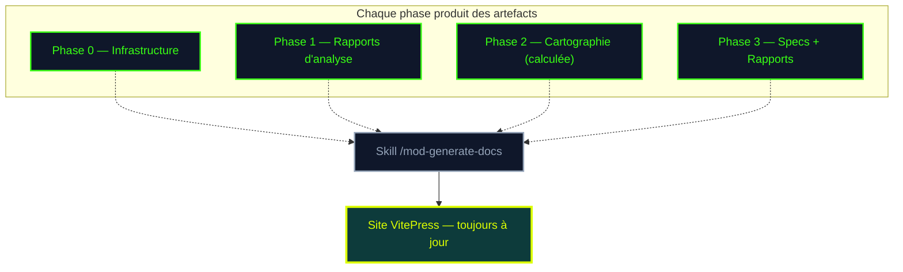
```mermaid
graph TB
    subgraph PHASES["Chaque phase produit des artefacts"]
        P0["Phase 0 — Infrastructure"]
        P1["Phase 1 — Rapports d'analyse"]
        P2["Phase 2 — Cartographie (calculée)"]
        P3["Phase 3 — Specs + Rapports"]
    end

    D["Skill /mod-generate-docs"]
    V["Site VitePress — toujours à jour"]

    P0 -.-> D
    P1 -.-> D
    P2 -.-> D
    P3 -.-> D
    D --> V

    classDef phase fill:#0f172a,stroke:#39ff14,stroke-width:2px,color:#39ff14
    classDef haiku fill:#0f172a,stroke:#94a3b8,stroke-width:2px,color:#94a3b8
    classDef output fill:#0d3b3b,stroke:#ddff00,stroke-width:3px,color:#ddff00

    class P0,P1,P2,P3 phase
    class D haiku
    class V output
```

:::tip Exemple réel
Le wiki du cas d'usage *Classified Ads* : <a :href="withBase('/exemple-wiki-legacy/')" target="_blank" rel="noopener">cas d'usage réel (wiki) ↗</a>.
:::

**Comment le wiki est produit**
- **Une seule commande**, `/mod-generate-docs`, génère tout le wiki ou une seule feature.
- **Automatique** : le pipeline la lance à chaque étape clé ; on peut aussi la lancer à tout moment.
- **Chiffres calculés, jamais saisis** : tableau de bord, cartographie et timeline viennent des fichiers du projet.

Ce que l'équipe y suit : voir [Le wiki, tableau de bord du pilotage](#wiki-pilotage).

<CasUsageCards>
  <CasUsageCard page="modernisation/index.html#modernisation-—-vue-d-ensemble" title="Tableau de bord" desc="Avancement par feature : tâches faites, à faire, bloquées" />
  <CasUsageCard page="modernisation/index.html#pages" title="Pages de modernisation" desc="Une page par feature : spec, analyses, timeline, rapport" />
  <CasUsageCard page="docs/index.html#analyses-techniques" title="Analyses du legacy" desc="Analyses techniques et spécifications" />
</CasUsageCards>

<div class="validation-checkpoint">
<strong>Validation</strong>
<div class="role-line"><span class="role-badge architecte">Architecte</span><span>Relit et valide la documentation avant publication.</span></div>
</div>

---

## Comment les agents communiquent

Chaque agent travaille dans **son propre contexte** : il ne voit ni la conversation principale ni les autres agents. Ils communiquent donc par **fichiers** : l'un écrit, le suivant lit.

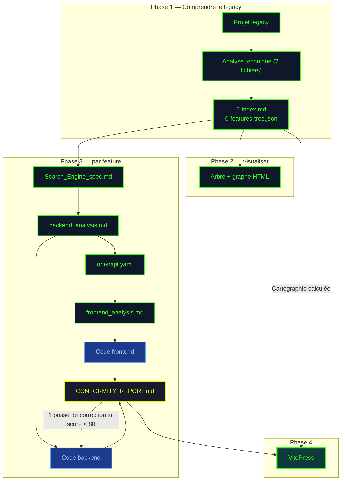
```mermaid
graph TB
    subgraph P1["Phase 1 — Comprendre le legacy"]
        LEGACY["Projet legacy"]
        TECH["Analyse technique (7 fichiers)"]
        INV["0-index.md<br/>0-features-tree.json"]
        LEGACY --> TECH --> INV
    end

    subgraph P2["Phase 2 — Visualiser"]
        VIZ["Arbre + graphe HTML"]
    end

    subgraph P3["Phase 3 — par feature"]
        SPEC["Search_Engine_spec.md"]
        BACK["backend_analysis.md"]
        OAS["openapi.yaml"]
        FRONT["frontend_analysis.md"]
        CODE_B["Code backend"]
        CODE_F["Code frontend"]
        REPORT["CONFORMITY_REPORT.md"]

        SPEC --> BACK --> OAS --> FRONT
        BACK --> CODE_B
        FRONT --> CODE_F
        CODE_B --> REPORT
        CODE_F --> REPORT
        REPORT -. "1 passe de correction si score < 80" .-> CODE_B
    end

    subgraph P4["Phase 4"]
        DOCS["VitePress"]
    end

    INV --> VIZ
    INV --> SPEC
    INV -->|"Cartographie calculée"| DOCS
    REPORT --> DOCS

    classDef file fill:#0f172a,stroke:#39ff14,stroke-width:2px,color:#39ff14
    classDef code fill:#1e3a8a,stroke:#60a5fa,stroke-width:2px,color:#93c5fd
    classDef report fill:#1a1a2e,stroke:#ddff00,stroke-width:2px,color:#ddff00
    classDef output fill:#0d3b3b,stroke:#39ff14,stroke-width:3px,color:#39ff14

    class LEGACY,TECH,INV,VIZ,SPEC,BACK,OAS,FRONT file
    class CODE_B,CODE_F code
    class REPORT report
    class DOCS output
```

Deux fichiers jouent un rôle particulier :
- **`openapi.yaml`** est le contrat entre backend et frontend : la planification backend le produit, la planification frontend s'appuie dessus.
- **Le rapport de conformité** est le seul retour en arrière du flux : si le score est inférieur à 80/100, ses issues critiques et élevées repartent une seule fois vers l'executor concerné, puis un rapport V2 est produit.

<p class="key-note"><span><strong>Avantage clé</strong> : chaque étape vérifie ses fichiers avant de continuer. En cas d'échec, on relance la même commande : le pipeline reprend où il s'est arrêté, sans refaire ce qui est déjà validé.</span></p>

```bash
/mod-migrate-feature Search_Engine
```

---

## Répartition des modèles

Le principe : **le modèle le moins cher qui produit la qualité requise**. Stratégie générale : [Quel modèle choisir](/concepts/agents#quel-modele-choisir).

<div class="model-distribution">
  <div class="model-bar">
    <div class="model-segment opus" style="flex: 2;">
      <span class="model-label">Opus</span>
      <span class="model-count">2</span>
    </div>
    <div class="model-segment sonnet" style="flex: 7;">
      <span class="model-label">Sonnet</span>
      <span class="model-count">7</span>
    </div>
    <div class="model-segment haiku" style="flex: 2;">
      <span class="model-label">Haiku</span>
      <span class="model-count">2</span>
    </div>
  </div>
  <div class="model-legend">
    <span class="legend-item opus">Opus — analyse profonde</span>
    <span class="legend-item sonnet">Sonnet — implémentation</span>
    <span class="legend-item haiku">Haiku — tâches légères</span>
  </div>
</div>

| Modèle | Quand | Agents |
|--------|-------|--------|
| **Opus** | Code brut non documenté, raisonnement complexe | technical-analyzer, feature-analyzer |
| **Sonnet** | Spec en entrée, patterns définis, TDD | planners, executors, conformity-reporter, refiner, functional-analyzer |
| **Haiku** | Templates clairs, vérifications simples | functional-analyzer-auditor, health-check |

- **Sonnet suffit** pour l'inventaire fonctionnel, qui lit le rapport technique et non le code brut.
- **Sonnet aussi** pour enrichir une spec existante, qui demande plus qu'une reformulation.
- **Chaque agent a une limite de tours** adaptée à sa tâche ; celle des agents d'implémentation est calculée pour un lot de 3 tâches.

---

## Ressources

- [Structure du projet .claude/](/examples/project-structure) — Organisation complète des fichiers
- [Pipeline de migration](/examples/pipeline) — Détail technique de chaque étape
- [Stratégie de modèles](/examples/model-strategy) — Choix Opus/Sonnet/Haiku par agent
- [How I Use Claude Code](https://boristane.com/blog/how-i-use-claude-code/) — Boris Tane : recherche, plan annoté, puis implémentation

---

*Vérifié avec **Claude Code v2.1.295** contre la documentation officielle le 10 octobre 2026. Une fonctionnalité plus récente peut manquer : voir le [journal des modifications](https://code.claude.com/docs/en/changelog).*
