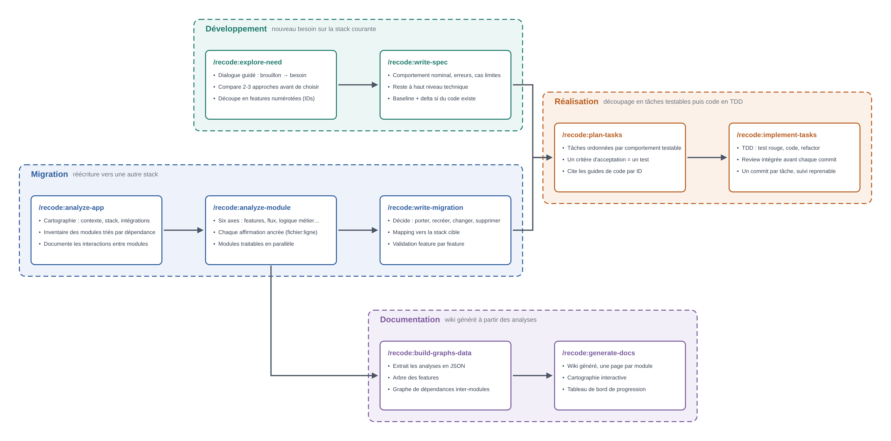

# Vue d'ensemble

**recode est un plugin Claude Code qui mène un projet du besoin, ou du code legacy, jusqu'au code livré et testé, étape par étape, avec une validation humaine à chaque étape.**

## Les 3 principes

1. **L'humain valide chaque étape.** Chaque skill est invoqué explicitement, un par un : pas d'enchaînement automatique.
2. **Les étapes communiquent par fichiers.** L'un écrit, le suivant lit : aucun état caché, tout est lisible, versionnable et partageable.
3. **Tout est réversible.** Le travail s'interrompt et reprend là où il s'est arrêté ; Git sert de filet de sécurité.

## Par où commencer

| Votre situation | Workflow | Premier skill |
|---|---|---|
| Un besoin neuf sur la stack courante | [Développement](./developpement) | `/recode:explore-need` |
| Un code existant à réécrire vers une autre stack | [Migration](./migration) | `/recode:analyze-app` |

Les deux workflows se rejoignent ensuite dans [Réalisation](./realisation) : découpage en tâches testables, puis code en TDD. La [Documentation](./documentation) se génère à partir des analyses de la migration.

## Choix d'architecture

::: details Le choix du plugin
- Un package unique, installé et mis à jour à un seul endroit, au lieu de copies de `.claude/` qui divergent d'un projet à l'autre
- Un workspace couvre plusieurs dépôts (source, cibles) : un `.claude/` appartient à un seul dépôt, le plugin reste indépendant des projets
- Aucune trace dans les dépôts de code : leur historique reste propre
- Une même expérience pour tous les projets, sans réinstaller ni recopier quoi que ce soit
:::

::: details Configuration
- Chaque skill déclare les chemins dont il a besoin ; la configuration est propre à chaque workspace et stockée hors des dépôts
- Des variables prédéfinies couvrent les besoins courants : projet source, projets cibles, guides de code, dossiers d'artefacts
- À la première utilisation, une valeur intelligente est proposée pour chaque variable manquante, déduite de l'arborescence du workspace
- L'utilisateur confirme ou corrige une seule fois ; les invocations suivantes ne redemandent rien
:::

::: details Coordination entre les étapes
- L'utilisateur invoque chaque skill explicitement, un par un : pas d'enchaînement automatique
- Les skills collaborent par les fichiers qu'ils produisent : l'un écrit, le suivant lit
- Chaque étape est validée par l'humain avant de devenir l'entrée de la suivante
- Un skill d'accueil présente le parcours sans rien lancer
:::

::: details Gestion d'état
- Aucun état caché : tout est conservé dans des fichiers lisibles, versionnables et partageables
- Le travail peut être interrompu et repris à tout moment, là où il s'est arrêté
- Une dérive entre le plan et sa source est détectée avant d'implémenter
- Git sert de filet de sécurité : historique fin pendant le travail, retour arrière possible
:::
